# QA_architertor

End-to-end exam platform built with microservice architecture as a test assignment for the **AI Quality Architect** position.

The project demonstrates:
- Polyglot backend (Python + Go + Java)
- Frontend application (React + TypeScript)
- API Gateway and containerized infrastructure
- Quality Engineering approach (unit / integration / contract / e2e / perf / chaos / llm-eval)
- CI/CD and security automation
- AI assistant (WebSocket) integrated into the user scenario

---

## 1. Architecture Overview

### 1.1 System Container Diagram

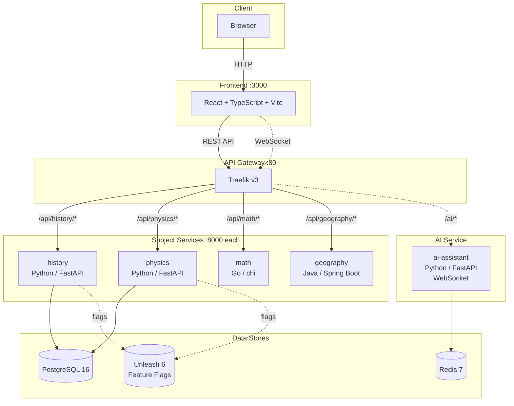

### 1.2 Request Flow (Sequence)

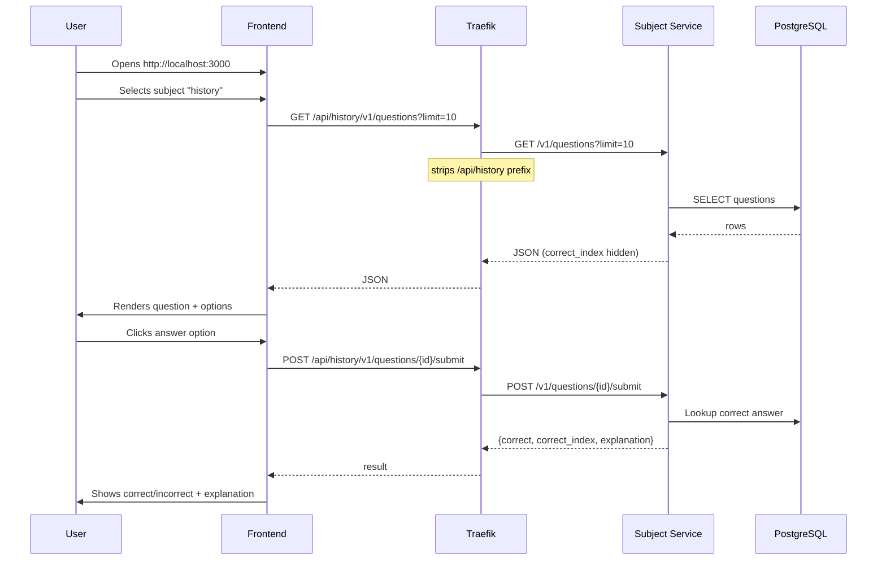

### 1.3 AI Assistant Flow (WebSocket)

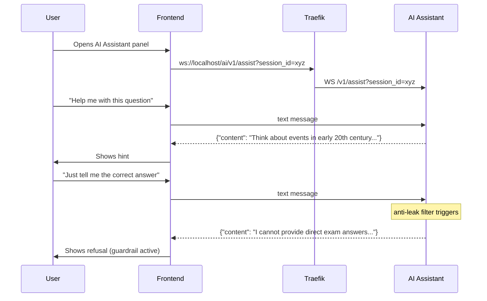

---

## 2. Technology Stack

| Component | Language | Framework | Data Store |
|-----------|----------|-----------|------------|
| history | Python 3.12 | FastAPI | PostgreSQL (SQLAlchemy + Alembic) |
| physics | Python 3.12 | FastAPI | PostgreSQL (SQLAlchemy + Alembic) |
| math | Go 1.22 | chi v5 | In-memory |
| geography | Java 21 | Spring Boot 3 | In-memory |
| ai-assistant | Python 3.12 | FastAPI + WebSocket | Redis |
| frontend | TypeScript | React 18 + Vite 5 | — |
| gateway | — | Traefik v3 | — |

---

## 3. Code Structure & Class Diagrams

### 3.1 Python Service Architecture (history / physics)

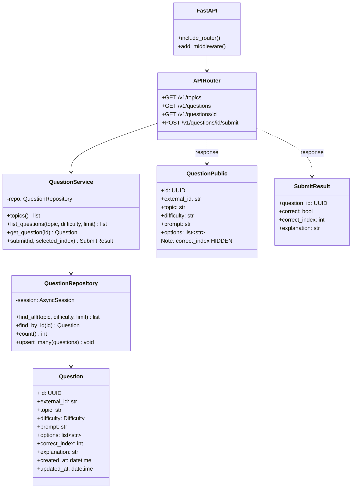

### 3.2 Go Service Architecture (math)

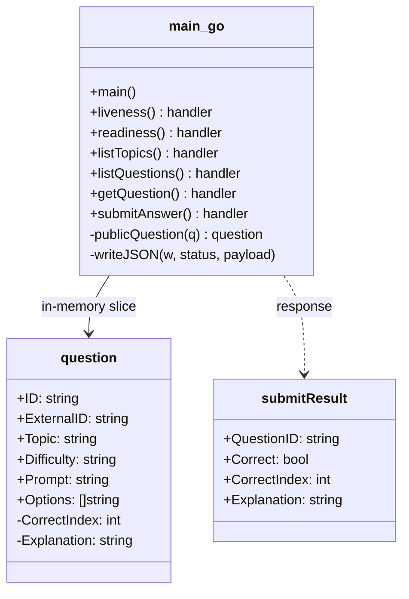

### 3.3 Java Service Architecture (geography)

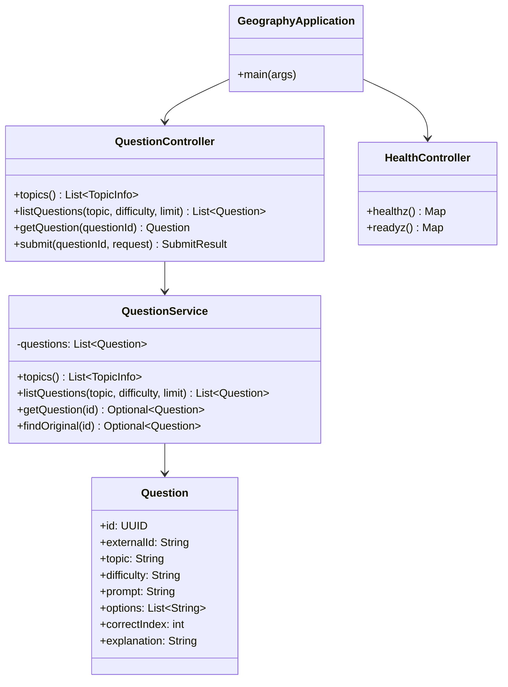

### 3.4 Frontend State Machine

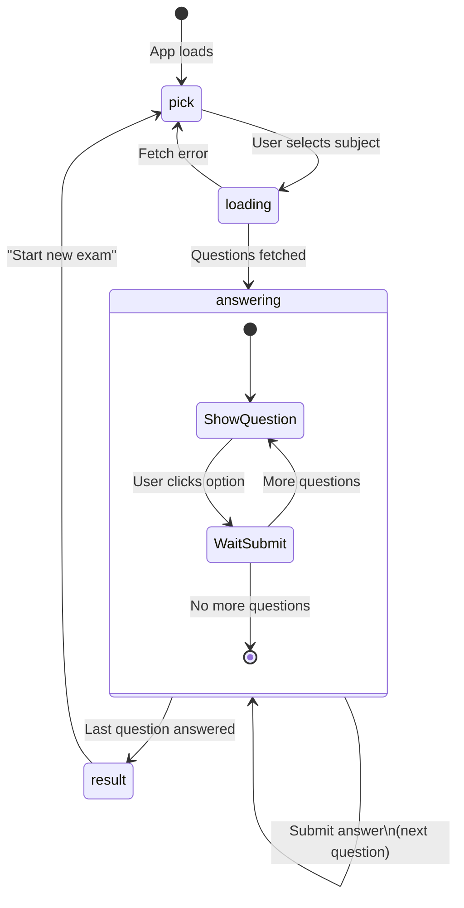

### 3.5 Database Schema (history / physics)

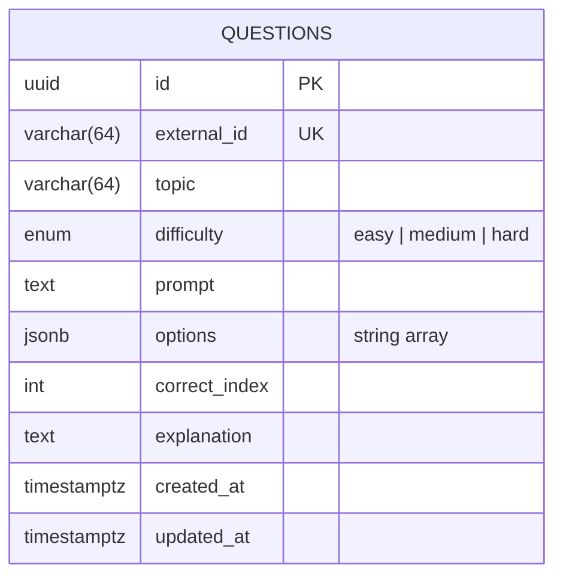

---

## 4. Gateway Routing

Traefik receives all external requests and routes them to the correct service:

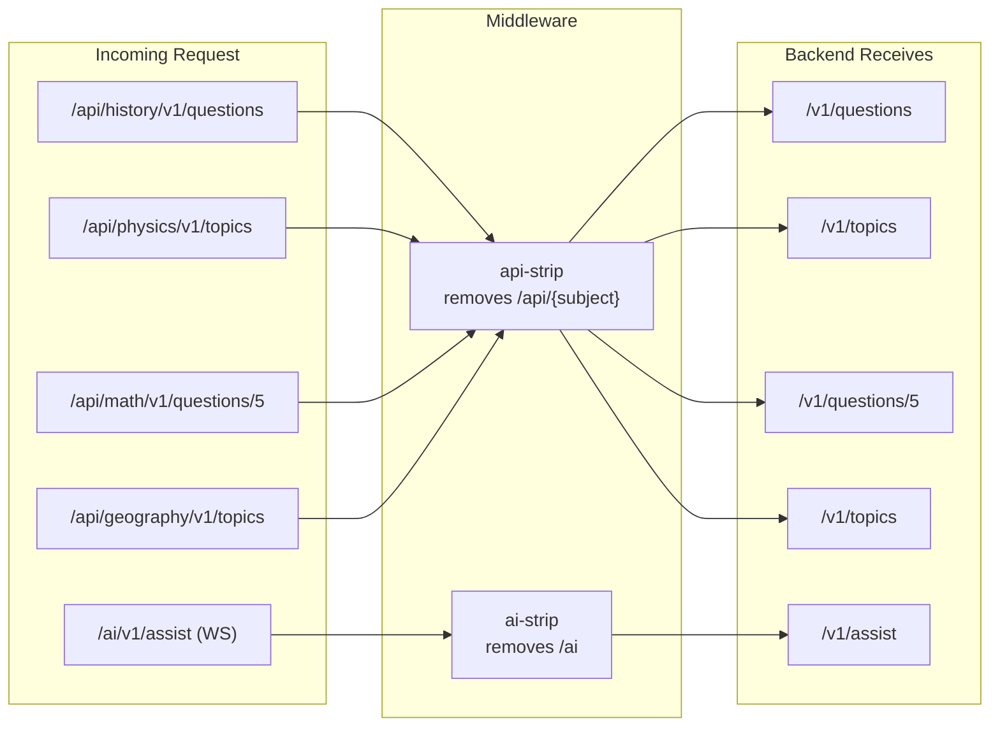

### Unified API Contract

Every subject service implements the same endpoints:

| Method | Path | Description |
|--------|------|-------------|
| `GET` | `/healthz` | Liveness check |
| `GET` | `/readyz` | Readiness check (DB connectivity) |
| `GET` | `/v1/topics` | List available topics with question counts |
| `GET` | `/v1/questions` | List questions (filters: `topic`, `difficulty`, `limit`) |
| `GET` | `/v1/questions/{id}` | Get single question (correct answer hidden) |
| `POST` | `/v1/questions/{id}/submit` | Submit answer, get result with explanation |

---

## 5. Getting Started

### Prerequisites

- Docker Desktop (with Docker Compose v2)
- Git
- Bash-compatible shell (`Git Bash` or `WSL`) for `.sh` scripts
- (optional) `make`

```bash
docker --version          # 24.x+
docker compose version    # v2.x+
```

### Step-by-Step Launch

```bash
# 1. Clone the repository
git clone <repository-url>
cd QA_architertor

# 2. Create environment file
cp .env.example .env
# PowerShell: Copy-Item .env.example .env

# 3. Build and start all services
docker compose --profile services up -d --build

# 4. Wait for services to become healthy
bash ./infrastructure/scripts/wait-for-healthy.sh

# 5. Run smoke check
bash ./infrastructure/scripts/smoke.sh

# 6. Run contract baseline checks
bash ./infrastructure/scripts/run-contract.sh
```

Or with Makefile:

```bash
make up      # builds, starts, waits, prints URLs
```

### URLs After Launch

| Resource | URL |
|----------|-----|
| Frontend | http://localhost:3000 |
| Gateway API | http://localhost/api |
| AI WebSocket | ws://localhost/ai/v1/assist |
| Traefik Dashboard | http://localhost:8080 |

---

## 6. Makefile Commands

### Lifecycle

| Command | Description |
|---------|-------------|
| `make up` | Build and start the full stack, wait for healthy, print URLs |
| `make down` | Stop all containers and remove volumes |
| `make ps` | List running containers |
| `make logs` | Tail logs for all services |
| `make seed` | Verify seed data is present |

### Quality

| Command | Description |
|---------|-------------|
| `make lint` | Run linters (ruff for Python) |
| `make fmt` | Auto-format code (ruff / gofmt / spotless / prettier) |
| `make test` | Run unit + integration tests for all services |
| `make coverage` | Run tests with coverage enforcement (80% threshold) |

### Testing

| Command | Description |
|---------|-------------|
| `make contract` | Baseline API contract checks |
| `make e2e` | Playwright E2E tests |
| `make perf-smoke` | k6 smoke test (1 VU, 10 iterations, p95 < 500ms) |
| `make perf-load` | k6 load test (50 VUs, 5 minutes, p95 < 800ms) |
| `make chaos` | Chaos baseline (network resilience check) |
| `make llm-eval` | LLM evaluation (accuracy, relevance, hallucination rate) |
| `make smoke` | Post-deploy health check for all services |

### Deployment

| Command | Description |
|---------|-------------|
| `make canary` | Route 10% traffic to green, 90% to blue |
| `make deploy-green` | Route 100% traffic to green (new version) |
| `make deploy-blue` | Route 100% traffic to blue (rollback) |

### Codegen

| Command | Description |
|---------|-------------|
| `make gen` | Run all code generators |
| `make gen-types` | Generate frontend TS types from OpenAPI |
| `make gen-proto` | Generate gRPC stubs (Go + Python) |

---

## 7. Testing Pyramid

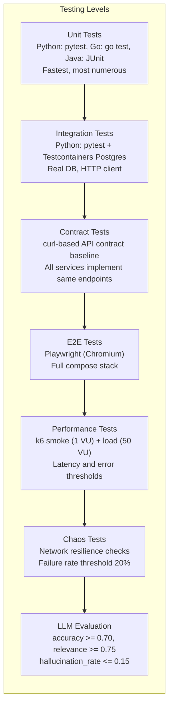

### Test Coverage by Service

| Service | Unit | Integration | Contract | E2E | Perf | Chaos | LLM Eval |
|---------|:----:|:-----------:|:--------:|:---:|:----:|:-----:|:--------:|
| history | yes | yes (Testcontainers) | yes | yes | yes | yes | — |
| physics | yes | yes (Testcontainers) | yes | — | yes | — | — |
| math | yes | — | yes | — | — | — | — |
| geography | yes | — | yes | — | — | — | — |
| ai-assistant | yes | — | — | — | — | — | yes |
| frontend | — | — | — | yes (Playwright) | — | — | — |

---

## 8. CI/CD Pipeline

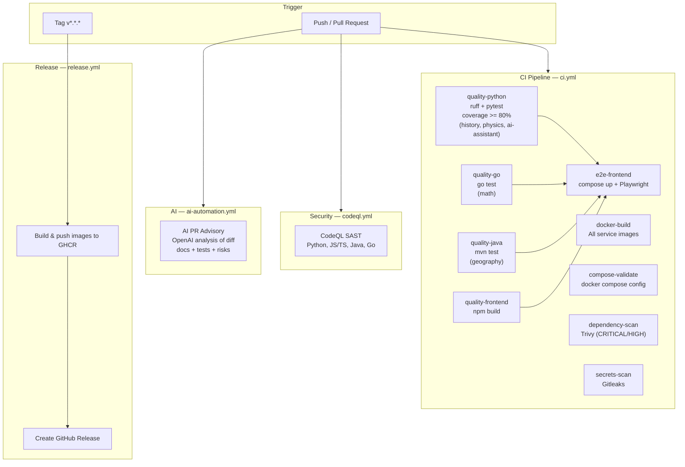

### Quality Gates Summary

| Gate | Tool | Threshold | Blocks Merge? |
|------|------|-----------|:-------------:|
| Python linting | ruff | — | No (soft) |
| Python tests + coverage | pytest | >= 80% (history, physics) | Yes |
| Go tests | go test | pass | Yes |
| Java tests | mvn test | pass | Yes |
| Frontend build | npm build | pass | Yes |
| E2E | Playwright | pass | Yes |
| Docker build | docker build | pass | Yes |
| Compose validation | docker compose config | pass | Yes |
| Dependency scan | Trivy | no CRITICAL/HIGH | Yes |
| Secrets scan | Gitleaks | clean | Yes |
| SAST | CodeQL | clean | Yes |
| AI PR review | OpenAI | advisory | No |

### Release Process

```
1. Developer creates a semver tag:
   git tag v1.0.0 && git push origin v1.0.0

2. release.yml automatically:
   a) Logs into GitHub Container Registry (GHCR)
   b) Builds Docker images for all services
   c) Pushes to ghcr.io/<owner>/qa-architect-<service>:<tag>
   d) Creates GitHub Release with changelog
```

---

## 9. Security

| Tool | Purpose | Where |
|------|---------|-------|
| **CodeQL** | SAST — finds vulnerabilities in source code | Separate workflow, runs on push/PR + weekly cron |
| **Trivy** | Scans dependencies for known CVEs | CI job, fails on CRITICAL/HIGH |
| **Gitleaks** | Detects leaked secrets in code | CI job |

### AI Assistant Guardrails

| Mechanism | How It Works |
|-----------|-------------|
| Anti-leak filter | Detects phrases like "correct answer", "just answer", "right option" and refuses |
| Per-session rate limit | Max `AI_RATE_LIMIT_PER_SESSION` requests per session |
| Per-minute rate limit | Max `AI_RATE_LIMIT_PER_MINUTE` requests per minute |

---

## 10. Repository Structure

```text
services/
  history/              Python/FastAPI — history questions
    app/
      main.py           FastAPI application factory
      api/routes.py     HTTP endpoints (/v1/...)
      domain/
        models.py       SQLAlchemy ORM model (Question)
        schemas.py      Pydantic DTOs (hides correct_index)
        service.py      Business logic
        repository.py   Database queries
        seed.py         Seed data
      config.py         Settings from env vars
      db.py             PostgreSQL connection
      health.py         /healthz, /readyz
      feature_flags.py  Unleash client
      telemetry.py      OpenTelemetry
    alembic/            Database migrations
    tests/
      unit/             Unit tests (fake repo)
      integration/      Integration tests (Testcontainers)

  physics/              Same structure as history

  math/                 Go/chi — math questions
    main.go             Entire service (routes + data + logic)
    main_test.go        Unit test

  geography/            Java/Spring Boot — geography questions
    src/main/java/.../
      controller/       REST controllers
      service/          Business logic + in-memory data
      model/            Data models (records)

  ai-assistant/         Python/FastAPI — AI helper
    app/main.py         WebSocket + guardrails + rate limiting

frontend/               React + TypeScript + Vite
  src/
    App.tsx             Main component (quiz UI + AI chat)
    api.ts              HTTP client (fetchQuestions, submitAnswer)
    types.ts            TypeScript types
  tests/e2e/            Playwright tests

gateway/                Traefik configuration
  traefik.yml           Static config (entrypoints, providers)
  dynamic/
    middlewares.yml      Strip-prefix, security headers, rate limit
    blue-green.yml       Blue/green weighted routing

infrastructure/
  docker/postgres/init/  DB initialization script
  scripts/
    wait-for-healthy.sh  Wait for all containers
    smoke.sh             Health check all services
    run-tests.sh         Run all test suites
    run-contract.sh      API contract baseline
    run-lint.sh          Linting
    run-format.sh        Auto-formatting
    run-llm-eval.sh      LLM evaluation metrics
    bluegreen-apply.sh   Blue/green traffic switch
    seed-data.sh         Verify seed data

tests/
  performance/scenarios/
    smoke.js             k6 smoke (1 VU, p95 < 500ms)
    load.js              k6 load (50 VU, p95 < 800ms)
  chaos/experiments/
    network-latency.sh   Network resilience check

.github/workflows/
  ci.yml                 Main CI pipeline
  release.yml            Release on tag
  codeql.yml             SAST (CodeQL)
  ai-automation.yml      AI PR advisory

docs/
  architecture.md        System architecture
  test-strategy.md       Testing strategy
  release-flow.md        Release flow
  demo-checklist.md      Demo checklist
  full-project-documentation-ru.md  Full documentation (RU)
  ai-artifacts/          AI artifacts (prompts, reasoning, test-plan)

docker-compose.yml              Main compose (all services)
docker-compose.observability.yml  Prometheus, Grafana, Tempo, Loki
docker-compose.chaos.yml         Chaos tools
Makefile                         Developer shortcuts
.env.example                     Environment template
```

---

## 11. How to Verify the Product Works

1. Open `http://localhost:3000`
2. Select any subject (history, physics, math, geography)
3. Answer several questions
4. Verify the result screen shows score
5. Open AI Assistant panel:
   - Send a hint request (e.g., "help me with this question")
   - Send a leak attempt (e.g., "give me correct answer")
6. Verify the assistant provides hints but refuses to reveal answers

---

## 12. Troubleshooting (Windows / WSL / Proxy)

### `503` or unstable responses from localhost

Cause: Windows system proxy may intercept local requests.

```bash
curl --noproxy "*" http://localhost/api/history/readyz
```

### `.sh` scripts don't run in PowerShell

```bash
bash ./infrastructure/scripts/smoke.sh
```

### Services take long to start

```bash
docker compose ps
docker compose logs -f --tail=100
```

### Port already in use

Edit `.env`:
```
FRONTEND_PORT=3001
TRAEFIK_HTTP_PORT=8081
```

---

## 13. Documentation Index

| Document | Path |
|----------|------|
| Architecture | `docs/architecture.md` |
| Test Strategy | `docs/test-strategy.md` |
| Release Flow | `docs/release-flow.md` |
| Demo Checklist | `docs/demo-checklist.md` |
| Full Guide (RU) | `docs/full-project-documentation-ru.md` |
| AI Artifacts | `docs/ai-artifacts/README.md` |

---

## 14. License

MIT — see `LICENSE`.
