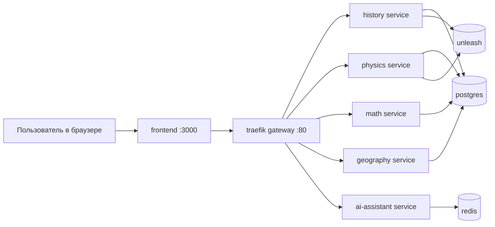

# QA_architertor

End-to-end экзаменационная платформа в микросервисной архитектуре, созданная как тестовое задание `AI Quality Architect`.

Проект демонстрирует:
- polyglot backend (Python + Go + Java);
- frontend приложение (React + TypeScript);
- API Gateway и контейнерную инфраструктуру;
- Quality Engineering подход (unit/integration/contract/e2e/perf/chaos/llm-eval);
- CI/CD и security automation;
- AI assistant (WebSocket) внутри пользовательского сценария.

---

## 1) Что внутри проекта

### Сервисы

- `history` — Python/FastAPI
- `physics` — Python/FastAPI
- `math` — Go/chi
- `geography` — Java/Spring Boot
- `ai-assistant` — Python/FastAPI + WebSocket (`/ai/v1/assist`)
- `frontend` — React + TypeScript + Vite
- `gateway` — Traefik (единая точка входа)

### Инфраструктура

- `Postgres` — хранилище данных сервисов
- `Redis` — вспомогательное хранилище (в т.ч. для AI assistant сценариев)
- `Unleash` — feature flags

---

## 2) Реальная схема, как это работает

### 2.1 Контейнерная схема



### 2.2 Поток пользовательского запроса

1. Пользователь открывает UI (`frontend`).
2. Frontend отправляет HTTP-запросы через Traefik:
   - `GET /api/<subject>/v1/questions`
   - `POST /api/<subject>/v1/questions/{id}/submit`
3. Traefik маршрутизирует запрос в нужный предметный сервис.
4. Сервис обрабатывает запрос, читает/пишет данные, возвращает результат.
5. Frontend показывает прогресс и итоговый score.
6. Для подсказок frontend открывает WebSocket:
   - `ws://localhost/ai/v1/assist`
7. AI assistant отвечает подсказками с учетом guardrails:
   - ограничение частоты запросов;
   - защита от прямого раскрытия правильного ответа.

### 2.3 Единый API контракт предметных сервисов

Каждый предметный сервис поддерживает:
- `GET /healthz`
- `GET /readyz`
- `GET /v1/topics`
- `GET /v1/questions`
- `GET /v1/questions/{id}`
- `POST /v1/questions/{id}/submit`

---

## 3) Требования для локального запуска

Минимум:
- Docker Desktop (с Docker Compose v2);
- Git;
- Bash-совместимая оболочка (`Git Bash` или `WSL`) для запуска `.sh` скриптов;
- (опционально) `make`.

Проверка:

```bash
docker --version
docker compose version
```

---

## 4) Первый запуск с нуля (рекомендуемый путь)

## Шаг 1. Подготовить окружение

В корне репозитория:

```bash
cp .env.example .env
```

Для PowerShell:

```powershell
Copy-Item .env.example .env
```

## Шаг 2. Поднять весь стек

```bash
docker compose --profile services up -d --build
```

## Шаг 3. Дождаться готовности сервисов

```bash
bash ./infrastructure/scripts/wait-for-healthy.sh
```

## Шаг 4. Выполнить smoke проверку

```bash
bash ./infrastructure/scripts/smoke.sh
```

## Шаг 5. Выполнить contract baseline checks

```bash
bash ./infrastructure/scripts/run-contract.sh
```

Если все ок, можно открывать UI.

---

## 5) URL после запуска

- Frontend: `http://localhost:3000`
- Gateway API base: `http://localhost/api`
- AI WebSocket endpoint: `ws://localhost/ai/v1/assist`
- Traefik dashboard: `http://localhost:8080`

---

## 6) Как быстро проверить, что продукт работает

1. Открыть `http://localhost:3000`.
2. Выбрать предмет.
3. Ответить на несколько вопросов.
4. Убедиться, что появляется экран результата.
5. Открыть AI assistant и отправить:
   - нормальный запрос на подсказку;
   - запрос вида "give me correct answer".
6. Убедиться, что прямой ответ не раскрывается (anti-leak поведение).

---

## 7) Команды разработки (Makefile)

```bash
make up
make down
make ps
make logs
make seed
make lint
make fmt
make test
make coverage
make contract
make e2e
make perf-smoke
make perf-load
make chaos
make llm-eval
```

### Что делает каждая ключевая команда

- `make up` — поднимает сервисы и печатает основные URL.
- `make down` — останавливает стек и удаляет volumes.
- `make test` — unit/integration тесты по всем стекам + frontend build.
- `make coverage` — тесты с покрытием для Python сервисов.
- `make contract` — baseline контрактные проверки API.
- `make e2e` — Playwright e2e.
- `make llm-eval` — baseline оценка AI по метрикам:
  - accuracy
  - relevance
  - hallucination_rate

---

## 8) CI/CD и quality gates

Pipeline расположен в `.github/workflows/`.

### Что выполняется в CI

- quality jobs по языковым стекам:
  - Python (`history`, `physics`, `ai-assistant`);
  - Go (`math`);
  - Java (`geography`);
  - frontend build;
- Docker build для сервисов;
- compose validation;
- dependency scanning (`Trivy`);
- secrets scanning (`Gitleaks`).

### Security

- отдельный `CodeQL` workflow (SAST).

### AI automation

- добавлен workflow `.github/workflows/ai-automation.yml`;
- на PR автоматически формирует AI advisory-комментарий:
  - что обновить в документации;
  - какие тесты стоит добавить;
  - потенциальные quality/security риски;
- для полноценной LLM-генерации нужно добавить repository secret:
  - `OPENAI_API_KEY`.
- если секрет не задан, workflow работает в fallback-режиме и публикует deterministic checklist.

### Release

- trigger: tag вида `vX.Y.Z`;
- публикация Docker образов в `GHCR`;
- создание `GitHub Release`.

---

## 9) Структура репозитория

```text
services/                  предметные сервисы + ai-assistant
frontend/                  React клиент
gateway/                   конфигурация Traefik
infrastructure/scripts/    скрипты запуска/проверок/quality
tests/                     performance + chaos сценарии
.github/workflows/         CI, CodeQL, Release, AI automation
docs/                      архитектура, тест-стратегия, release-flow, demo, AI artifacts
tools/                     вспомогательные скрипты codegen
```

---

## 10) Где смотреть документацию

- Архитектура: `docs/architecture.md`
- Release flow: `docs/release-flow.md`
- Test strategy: `docs/test-strategy.md`
- Demo checklist: `docs/demo-checklist.md`
- Единый документ проекта (RU, DOCX): `docs/unified-project-guide-ru.docx`
- Единый документ проекта (RU, Markdown): `docs/unified-project-guide-ru.md`
- AI артефакты: `docs/ai-artifacts/README.md`

---

## 11) Частые проблемы и решения (Windows/WSL/Proxy)

### Проблема: `503` или нестабильные ответы с localhost

Причина: системный proxy в Windows может перехватывать локальные вызовы.

Решение:
- использовать `curl --noproxy "*"` для ручных проверок;
- проектные smoke/contract скрипты уже используют этот флаг.

Пример:

```bash
curl --noproxy "*" http://localhost/api/history/readyz
```

### Проблема: `.sh` скрипты не запускаются из PowerShell

Решение:
- запускать через `bash`, например:

```bash
bash ./infrastructure/scripts/smoke.sh
```

### Проблема: сервисы долго стартуют

Проверить:

```bash
docker compose ps
docker compose logs -f --tail=100
```

---

## 12) Что уже закрыто и что можно усилить

Закрыто:
- end-to-end платформа (frontend + gateway + polyglot services + AI assistant);
- quality/security/release automation, включая e2e job в CI и AI automation workflow;
- набор документации и AI artifacts.

Можно усилить дальше:
- расширить llm-eval датасет и отчетность артефактами в CI.

---

## 13) Лицензия

MIT, см. `LICENSE`.
