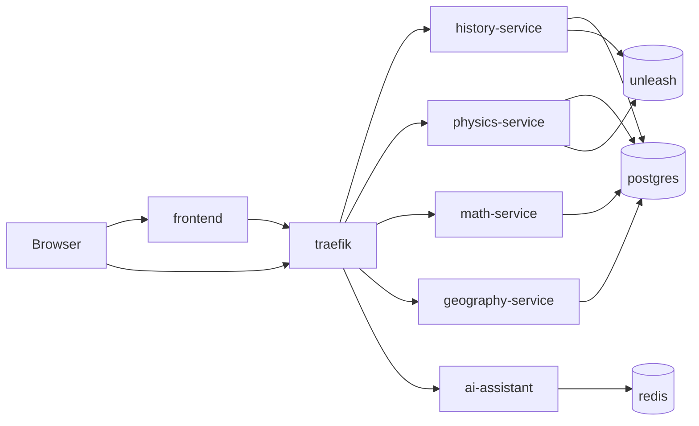

# Architecture Overview

## System context

The platform is an exam system with four subject services and one AI assistant:

- `history` and `physics` (Python/FastAPI)
- `math` (Go/chi)
- `geography` (Java/Spring Boot)
- `ai-assistant` (Python/FastAPI, WebSocket)

Traffic is routed through Traefik.

## Container view

## API contracts

Subject services expose a unified contract:

- `GET /healthz`
- `GET /readyz`
- `GET /v1/topics`
- `GET /v1/questions`
- `GET /v1/questions/{id}`
- `POST /v1/questions/{id}/submit`

AI assistant:

- `GET /healthz`
- `GET /readyz`
- `WS /ai/v1/assist`

## Architectural decisions

- Keep a stable subject-service API so frontend and contract checks can be shared.
- Use gateway routing by path prefix (`/api/<subject>`, `/ai`) to hide internal topology.
- Keep mock LLM mode as default to ensure deterministic local/CI runs.
