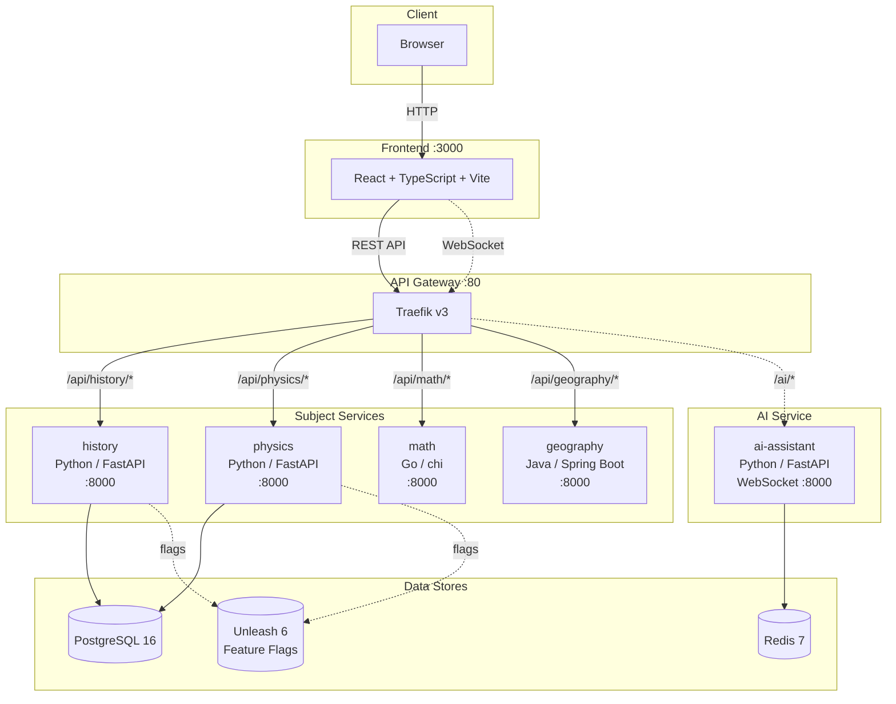
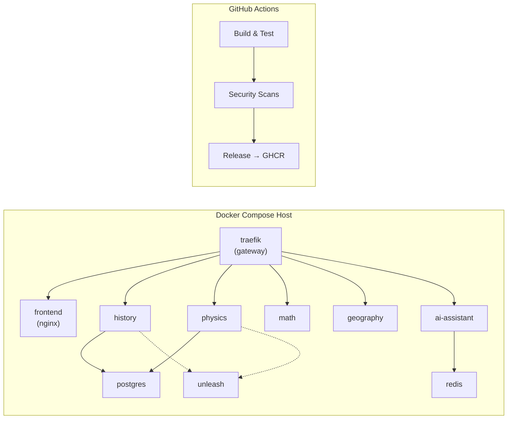

# Architecture Overview

## 1. System Context

The platform is an online exam system designed as a polyglot microservice architecture. It serves as a test assignment for the **AI Quality Architect** position, demonstrating competence in distributed systems, quality engineering, CI/CD automation, and AI integration.

### Actors

| Actor | Description |
|-------|-------------|
| **Student** | Takes exams via the browser, receives scores and AI-powered hints |
| **CI/CD Pipeline** | Builds, tests, scans, and releases services automatically |
| **AI PR Reviewer** | Analyses pull request diffs and posts advisory comments |

### External Dependencies

| Dependency | Purpose | Risk if Unavailable |
|------------|---------|---------------------|
| GitHub Actions | CI/CD execution | Builds and releases blocked |
| GitHub Container Registry (GHCR) | Docker image hosting | Release images unavailable |
| OpenAI API (optional) | AI PR advisory and future LLM provider | Falls back to mock/checklist mode |

---

## 2. Container View

```mermaid
flowchart TB
    subgraph Client
        Browser["Browser"]
    end

    subgraph Frontend["Frontend :3000"]
        React["React + TypeScript + Vite"]
    end

    subgraph Gateway["API Gateway :80"]
        Traefik["Traefik v3"]
    end

    subgraph SubjectServices["Subject Services"]
        History["history\nPython / FastAPI\n:8000"]
        Physics["physics\nPython / FastAPI\n:8000"]
        Math["math\nGo / chi\n:8000"]
        Geo["geography\nJava / Spring Boot\n:8000"]
    end

    subgraph AI["AI Service"]
        Assistant["ai-assistant\nPython / FastAPI\nWebSocket :8000"]
    end

    subgraph Data["Data Stores"]
        PG[("PostgreSQL 16")]
        Redis[("Redis 7")]
        Unleash[("Unleash 6\nFeature Flags")]
    end

    Browser -->|"HTTP"| React
    React -->|"REST API"| Traefik
    React -.->|"WebSocket"| Traefik

    Traefik -->|"/api/history/*"| History
    Traefik -->|"/api/physics/*"| Physics
    Traefik -->|"/api/math/*"| Math
    Traefik -->|"/api/geography/*"| Geo
    Traefik -.->|"/ai/*"| Assistant

    History --> PG
    Physics --> PG
    History -.->|"flags"| Unleash
    Physics -.->|"flags"| Unleash
    Assistant --> Redis
```

> **Note:** `math` (Go) and `geography` (Java) use **in-memory** data stores — they do not connect to PostgreSQL. Only `history` and `physics` (Python/FastAPI) persist data in PostgreSQL via SQLAlchemy + Alembic.

---

## 3. API Contracts

### 3.1 Subject Services — Unified Contract

Every subject service implements the same endpoint set, enabling a single contract test script and a language-agnostic frontend.

| Method | Path | Description |
|--------|------|-------------|
| `GET` | `/healthz` | Liveness probe (always 200) |
| `GET` | `/readyz` | Readiness probe (checks DB or data availability) |
| `GET` | `/v1/topics` | List available topics with question counts |
| `GET` | `/v1/questions` | List questions (query: `topic`, `difficulty`, `limit`) |
| `GET` | `/v1/questions/{id}` | Single question (`correct_index` hidden in response) |
| `POST` | `/v1/questions/{id}/submit` | Submit answer → returns `{correct, correct_index, explanation}` |

### 3.2 AI Assistant

| Method | Path | Description |
|--------|------|-------------|
| `GET` | `/healthz` | Liveness probe |
| `GET` | `/readyz` | Readiness probe |
| `WS` | `/v1/assist` | WebSocket — accepts text messages, returns hints |

---

## 4. Deployment View

```mermaid
flowchart LR
    subgraph DockerCompose["Docker Compose Host"]
        FE["frontend\n(nginx)"]
        GW["traefik\n(gateway)"]
        H["history"]
        PH["physics"]
        M["math"]
        G["geography"]
        AI["ai-assistant"]
        PG["postgres"]
        RD["redis"]
        UL["unleash"]
    end

    subgraph CI["GitHub Actions"]
        Build["Build & Test"]
        Scan["Security Scans"]
        Release["Release → GHCR"]
    end

    GW --> FE
    GW --> H & PH & M & G & AI
    H & PH --> PG
    AI --> RD
    H & PH -.-> UL

    Build --> Scan --> Release
```

### Environment Matrix

| Environment | Compose Profile | Purpose |
|-------------|-----------------|---------|
| **Development** | `--profile services` | Local development, all services + datastores |
| **Observability** | `docker-compose.observability.yml` | Adds Prometheus, Grafana, Tempo, Loki |
| **Chaos** | `docker-compose.chaos.yml` | Adds chaos engineering tooling |
| **CI** | Compose-in-Docker | GitHub Actions — same compose stack for E2E |

### Blue/Green Deployment

Traefik supports weighted routing via `gateway/dynamic/blue-green.yml`:

| Command | Traffic Distribution |
|---------|---------------------|
| `make canary` | 10% green / 90% blue |
| `make deploy-green` | 100% green |
| `make deploy-blue` | 100% blue (rollback) |

---

## 5. Security View

### 5.1 Threat Model (STRIDE-lite)

| Threat | Vector | Mitigation | Status |
|--------|--------|------------|--------|
| **Answer Leakage** | AI assistant reveals correct answers | Anti-leak keyword filter + refusal response | Implemented |
| **Answer Leakage** | Frontend exposes `correct_index` in question payload | `QuestionPublic` schema hides `correct_index` and `explanation` | Implemented |
| **Brute-force AI** | Excessive AI requests to extract answers | Per-session + per-minute rate limiting | Implemented |
| **Dependency CVEs** | Known vulnerabilities in third-party packages | Trivy scan in CI (fails on CRITICAL/HIGH) | Implemented |
| **Secret Exposure** | Credentials committed to repository | Gitleaks scan in CI | Implemented |
| **Code Vulnerabilities** | SQL injection, XSS, etc. | CodeQL SAST across all 4 language stacks | Implemented |
| **Missing Auth** | No user authentication | Out of scope for test assignment; noted as risk | Accepted |
| **MITM / No TLS** | Local traffic unencrypted | Traefik `secure-headers` middleware defined (not yet wired to routers) | Partial |
| **Header Injection** | Missing security headers in responses | HSTS, X-Content-Type, XSS-Protection headers defined in middleware | Partial |

### 5.2 Security Scanning Pipeline

| Tool | What | Blocks Merge? |
|------|------|:-------------:|
| CodeQL | SAST — Python, JS/TS, Java, Go | Yes |
| Trivy | Dependency CVE scan (CRITICAL/HIGH) | Yes |
| Gitleaks | Secret detection in source code | Yes |

---

## 6. Quality Attributes & Non-Functional Requirements

| Attribute | Target | How Validated |
|-----------|--------|---------------|
| **Availability** | All services pass `/readyz` within 180s of `compose up` | `wait-for-healthy.sh` with timeout |
| **Latency (smoke)** | p95 < 500ms at 1 VU | k6 smoke scenario |
| **Latency (load)** | p95 < 800ms at 50 VUs, 5 min | k6 load scenario |
| **Error rate (chaos)** | < 20% failure under network degradation | `network-latency.sh` chaos experiment |
| **Test coverage** | ≥ 80% line coverage (Python services) | pytest-cov in CI |
| **AI accuracy** | ≥ 0.70 | `run-llm-eval.sh` baseline |
| **AI relevance** | ≥ 0.75 | `run-llm-eval.sh` baseline |
| **AI hallucination** | ≤ 0.15 | `run-llm-eval.sh` baseline |
| **Security** | Zero CRITICAL/HIGH CVEs, zero leaked secrets | Trivy + Gitleaks in CI |
| **Portability** | Runs on any Docker-capable host (Linux, macOS, Windows+WSL) | Docker Compose based deployment |

---

## 7. Risks & Mitigations

| # | Risk | Likelihood | Impact | Mitigation | Owner |
|---|------|:----------:|:------:|------------|-------|
| R1 | **Mock-only AI** — AI assistant in mock mode doesn't validate real LLM behavior | High | Medium | `LLM_PROVIDER` env var ready for real provider; `run-llm-eval.sh` establishes baseline metrics | Dev |
| R2 | **No authentication** — any user can access any exam | High | Medium | Accepted for test assignment scope; would require auth middleware + user service for production | Architect |
| R3 | **In-memory data loss** — math/geography lose data on restart | Medium | Low | Acceptable: questions are hardcoded; production would need persistent store | Dev |
| R4 | **Single Postgres** — no replication or failover | Medium | High | Docker Compose is single-host; production would use managed PostgreSQL (RDS/Cloud SQL) | Ops |
| R5 | **Feature flags initialized but unused** — Unleash client in history/physics but no flags in routers | Medium | Low | Infrastructure ready; flags can be wired when feature toggling is needed | Dev |
| R6 | **Security headers defined but not wired** — `secure-headers` and `ai-ratelimit` middlewares exist but aren't attached to Traefik routers | Medium | Medium | Wire middlewares to routers before production deployment | DevOps |
| R7 | **E2E coverage gaps** — only history has full E2E path; physics/math/geography lack E2E | Medium | Medium | Extend Playwright tests to cover all subject services | QA |
| R8 | **Threshold inconsistency** across documents could cause confusion | Low | Medium | Canonical thresholds defined in this document (Section 6); all other docs must reference these | Doc |
| R9 | **Windows proxy interference** — `503` errors on localhost due to system proxy | Medium | Low | Documented workaround: `curl --noproxy "*"` | Dev |

---

## 8. Architectural Decisions

### ADR-001: Unified Subject Service API Contract

- **Context:** Four services in four language stacks must serve the same frontend.
- **Decision:** All subject services implement an identical REST API contract (`/v1/topics`, `/v1/questions`, `/v1/questions/{id}/submit`).
- **Alternatives considered:** GraphQL (adds complexity without proportional benefit for this domain), gRPC (not browser-friendly without gateway transcoding).
- **Consequences:** One contract test script works for all. Frontend is language-agnostic. Adding new subjects requires only implementing the same interface.

### ADR-002: Gateway-First Traffic Model (Traefik)

- **Context:** Frontend and tests need stable URLs regardless of backend topology changes.
- **Decision:** All traffic routes through Traefik using path-prefix routing (`/api/<subject>`, `/ai`). Traefik strips prefixes before forwarding.
- **Alternatives considered:** Nginx (less dynamic), service mesh (overkill for this scope).
- **Consequences:** Services can be moved, scaled, or replaced without changing client code. Blue/green deployment becomes a routing configuration change.

### ADR-003: Mock-First AI Provider

- **Context:** Test assignment must run locally and in CI without external API keys.
- **Decision:** AI assistant defaults to `LLM_PROVIDER=mock` with deterministic, hardcoded responses. Real provider requires explicit opt-in via env var.
- **Alternatives considered:** Always require API key (blocks reviewers), use local model (heavy resource requirements).
- **Consequences:** Deterministic CI. Reviewers can evaluate architecture and integration without API costs. LLM eval script establishes baseline metrics against mock behavior.

### ADR-004: PostgreSQL for Stateful Services, In-Memory for Stateless

- **Context:** Assignment requires data storage. Two Python services benefit from ORM + migrations. Go and Java services have small, static question sets.
- **Decision:** `history` and `physics` use PostgreSQL (SQLAlchemy + Alembic). `math` and `geography` store questions in-memory (hardcoded).
- **Alternatives considered:** All services on PostgreSQL (unnecessary complexity for static data), SQLite (not production-representative).
- **Consequences:** Python services demonstrate full ORM lifecycle (migrations, seed, async queries). Go/Java services stay lightweight. Trade-off: in-memory data is lost on restart (acceptable for static seed data).

### ADR-005: Anti-Leak Guardrails Over Prompt Engineering

- **Context:** AI assistant must help without revealing answers.
- **Decision:** Implement keyword-based anti-leak filter as the primary guardrail, supplemented by rate limiting. This is more deterministic than relying solely on prompt engineering.
- **Alternatives considered:** Pure prompt engineering (non-deterministic, can be jailbroken), embedding-based semantic filter (overkill for mock mode).
- **Consequences:** Guaranteed refusal for known leak patterns. Simple to test and verify. Can be layered with prompt engineering when real LLM is connected.

---

## 9. Technology Decisions Matrix

| Component | Technology | Version | Rationale |
|-----------|-----------|---------|-----------|
| history, physics | Python + FastAPI | 3.12 / 0.110+ | Async, auto-docs, strong typing with Pydantic |
| math | Go + chi | 1.22 / v5 | Lightweight, fast compilation, minimal dependencies |
| geography | Java + Spring Boot | 21 / 3.x | Enterprise-grade, wide ecosystem, demonstrates JVM competence |
| ai-assistant | Python + FastAPI | 3.12 | WebSocket support, same stack as subject services for consistency |
| frontend | React + TypeScript + Vite | 18 / 5.x / 5.x | Modern SPA stack, strong typing, fast HMR |
| gateway | Traefik | v3 | Native Docker provider, dynamic config, middleware pipeline |
| database | PostgreSQL | 16 | ACID, JSON support, production-representative |
| cache/sessions | Redis | 7 | Fast key-value store for rate limiting and session data |
| feature flags | Unleash | 6 | Open-source, self-hosted, SDK support for Python |
| ORM | SQLAlchemy (async) | 2.x | Mature Python ORM with async engine support |
| migrations | Alembic | 1.x | Standard migration tool for SQLAlchemy |
| telemetry | OpenTelemetry | Latest | Vendor-neutral observability standard |
