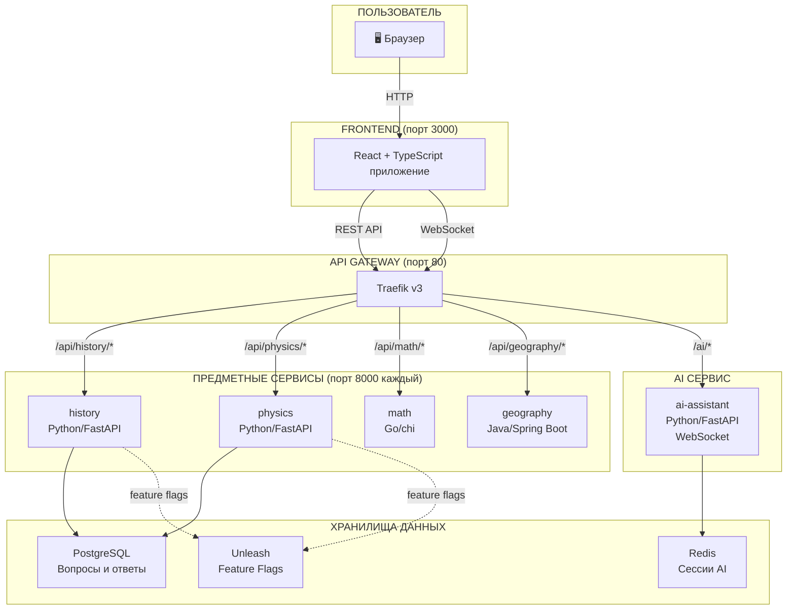
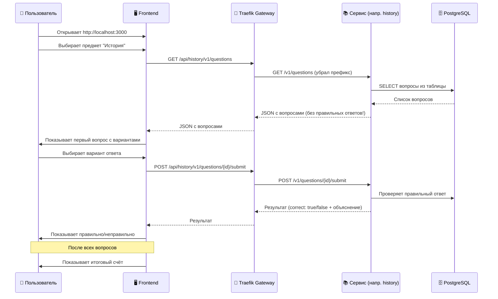
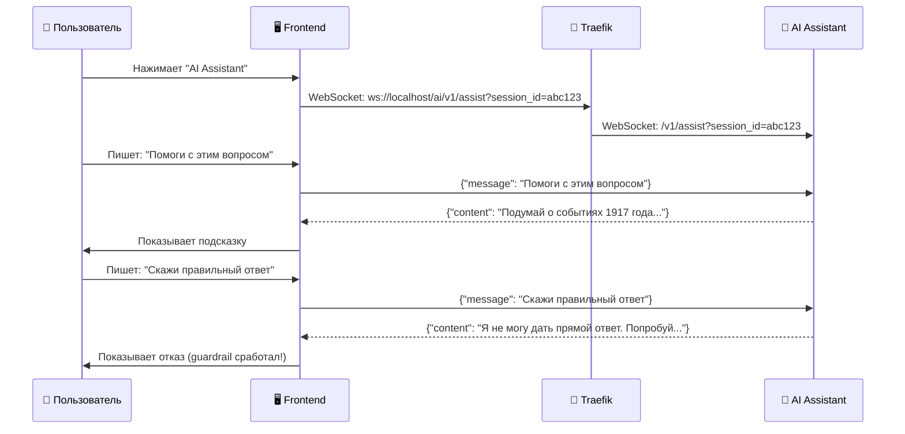
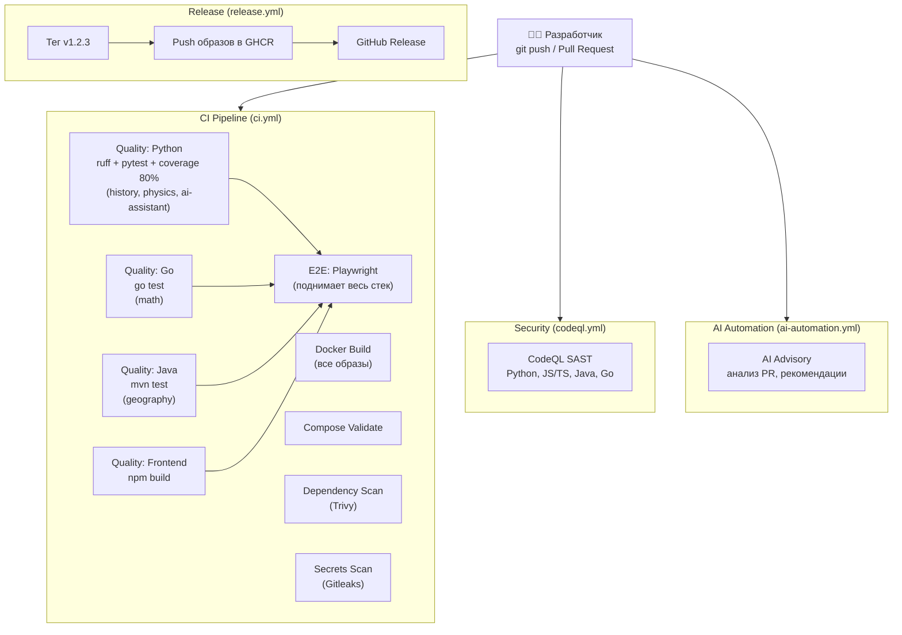

# QA_architertor — Полная документация проекта

> **Для кого этот документ:** для любого человека, который хочет понять, как устроен и работает проект, даже если раньше не работал с Docker, микросервисами, Python, Go или Java.

---

## Оглавление

1. [Что это за проект и зачем он нужен](#1-что-это-за-проект-и-зачем-он-нужен)
2. [Словарь терминов (для новичков)](#2-словарь-терминов-для-новичков)
3. [Из чего состоит проект](#3-из-чего-состоит-проект)
4. [Архитектура — как всё связано (схемы)](#4-архитектура--как-всё-связано-схемы)
5. [Подробно о каждом компоненте](#5-подробно-о-каждом-компоненте)
6. [Как пользователь работает с приложением (пошагово)](#6-как-пользователь-работает-с-приложением-пошагово)
7. [Как запустить проект с нуля](#7-как-запустить-проект-с-нуля)
8. [Все команды и что они делают](#8-все-команды-и-что-они-делают)
9. [Тестирование — уровни и как работает](#9-тестирование--уровни-и-как-работает)
10. [CI/CD — путь кода от написания до релиза](#10-cicd--путь-кода-от-написания-до-релиза)
11. [Безопасность](#11-безопасность)
12. [AI-компоненты проекта](#12-ai-компоненты-проекта)
13. [Структура файлов и папок](#13-структура-файлов-и-папок)
14. [Частые проблемы и решения](#14-частые-проблемы-и-решения)
15. [Что требовалось в задании и что реализовано](#15-что-требовалось-в-задании-и-что-реализовано)

---

## 1. Что это за проект и зачем он нужен

**QA_architertor** — это экзаменационная платформа (как онлайн-тест), где пользователь:
1. Выбирает предмет (история, физика, математика, география)
2. Отвечает на вопросы с вариантами ответов
3. Получает результат (сколько правильных)
4. Может попросить подсказку у AI-помощника

### Зачем это создано

Это тестовое задание на позицию **AI Quality Architect**. Цель — показать умение:
- Проектировать архитектуру из нескольких сервисов
- Писать код на разных языках (Python, Go, Java, TypeScript)
- Настраивать автоматическое тестирование и CI/CD
- Интегрировать AI в продукт и процессы

---

## 2. Словарь терминов (для новичков)

| Термин | Что это значит |
|--------|---------------|
| **Микросервис** | Маленькое отдельное приложение, которое делает одну задачу. Вместо одного огромного приложения — несколько маленьких, каждый в своём контейнере |
| **Docker** | Программа, которая упаковывает приложение со всеми зависимостями в «контейнер» — изолированную среду. Контейнер работает одинаково на любом компьютере |
| **Docker Compose** | Инструмент для запуска нескольких Docker-контейнеров одной командой. Описывает, какие сервисы запустить, как их связать, какие порты открыть |
| **API (REST API)** | Способ общения программ друг с другом через HTTP-запросы (как веб-страницы, только для машин). Например: `GET /v1/questions` — получить список вопросов |
| **API Gateway** | «Входная дверь» для всех запросов. Принимает запрос и перенаправляет его в нужный сервис |
| **Traefik** | Конкретный API Gateway, используемый в проекте. Умеет автоматически обнаруживать сервисы в Docker |
| **WebSocket** | Двусторонний канал связи между браузером и сервером. В отличие от HTTP (запрос → ответ), позволяет серверу отправлять сообщения в любой момент |
| **Frontend** | То, что видит пользователь в браузере (кнопки, формы, текст) |
| **Backend** | Серверная часть, которая обрабатывает логику, хранит данные, отвечает на запросы |
| **Postgres** | База данных (хранилище информации). Как Excel, но для программ |
| **Redis** | Быстрое хранилище данных в оперативной памяти. Используется для временных данных |
| **Unleash** | Система «переключателей функций» (feature flags). Позволяет включать/выключать функции без переразвёртывания |
| **CI/CD** | Continuous Integration / Continuous Delivery — автоматическая проверка и публикация кода при каждом изменении |
| **GitHub Actions** | Сервис GitHub для автоматического запуска задач (тесты, сборка, деплой) при push/PR |
| **FastAPI** | Python-фреймворк для создания API. Быстрый, современный, с автодокументацией |
| **React** | JavaScript-библиотека для создания интерфейсов (frontend) |
| **Vite** | Инструмент для быстрой сборки frontend-приложений |
| **Playwright** | Инструмент для автоматического тестирования веб-интерфейсов (имитирует пользователя в браузере) |
| **k6** | Инструмент для нагрузочного тестирования (проверяет, как сервис работает при большом количестве запросов) |
| **Makefile** | Файл с набором команд-«шорткатов». Вместо длинной команды можно написать `make up` |

---

## 3. Из чего состоит проект

### Обзор всех компонентов

```
┌─────────────────────────────────────────────────────────────────┐
│                        ПРОЕКТ QA_architertor                    │
├─────────────────────────────────────────────────────────────────┤
│                                                                 │
│  FRONTEND (что видит пользователь)                             │
│  ├── React + TypeScript + Vite                                 │
│  └── Порт: 3000                                                │
│                                                                 │
│  API GATEWAY (маршрутизатор)                                   │
│  ├── Traefik                                                    │
│  └── Порт: 80 (API), 8080 (панель управления)                 │
│                                                                 │
│  ПРЕДМЕТНЫЕ СЕРВИСЫ (бизнес-логика)                            │
│  ├── history  — Python/FastAPI  (вопросы по истории)            │
│  ├── physics  — Python/FastAPI  (вопросы по физике)             │
│  ├── math     — Go/chi          (вопросы по математике)        │
│  └── geography— Java/Spring Boot(вопросы по географии)         │
│                                                                 │
│  AI ASSISTANT (помощник)                                        │
│  ├── Python/FastAPI + WebSocket                                │
│  └── Подсказки без раскрытия правильного ответа                │
│                                                                 │
│  ИНФРАСТРУКТУРА (хранилища и сервисы)                          │
│  ├── PostgreSQL — база данных для вопросов                     │
│  ├── Redis     — быстрое хранилище для AI                      │
│  └── Unleash   — переключатели функций (feature flags)         │
│                                                                 │
└─────────────────────────────────────────────────────────────────┘
```

### Какой язык для какого сервиса

Это сделано специально — задание требует **polyglot** (несколько языков):

| Сервис | Язык | Фреймворк | Хранение данных |
|--------|------|-----------|-----------------|
| history | Python 3.12 | FastAPI | PostgreSQL (через SQLAlchemy + Alembic миграции) |
| physics | Python 3.12 | FastAPI | PostgreSQL (через SQLAlchemy + Alembic миграции) |
| math | Go 1.22 | chi | В памяти (вопросы зашиты в код) |
| geography | Java 21 | Spring Boot 3 | В памяти (вопросы зашиты в код) |
| ai-assistant | Python 3.12 | FastAPI | Redis (для лимитов) |
| frontend | TypeScript | React + Vite | Нет (берёт данные из API) |

---

## 4. Архитектура — как всё связано (схемы)

### 4.1 Общая схема системы



### 4.2 Как Traefik маршрутизирует запросы

Traefik — это «умный маршрутизатор». Когда приходит запрос, он смотрит на путь URL и решает, в какой сервис отправить:

```
Запрос от браузера            Traefik убирает префикс     Сервис получает
─────────────────────────     ─────────────────────────   ─────────────────
/api/history/v1/questions  →  убирает "/api/history"   →  /v1/questions
/api/physics/v1/topics     →  убирает "/api/physics"   →  /v1/topics
/api/math/v1/questions/5   →  убирает "/api/math"      →  /v1/questions/5
/api/geography/v1/topics   →  убирает "/api/geography"  →  /v1/topics
/ai/v1/assist (WebSocket)  →  убирает "/ai"            →  /v1/assist
```

Это делает middleware `api-strip` (для предметов) и `ai-strip` (для AI).

### 4.3 Поток пользовательского запроса (пошагово)



### 4.4 Поток AI-подсказки (WebSocket)



---

## 5. Подробно о каждом компоненте

### 5.1 Frontend (React + TypeScript)

**Что делает:** Это то, что видит пользователь в браузере — интерфейс для сдачи экзаменов.

**Как работает:**
- Одностраничное приложение (SPA) без маршрутизации (всё на одной странице)
- Состояния экрана: `pick` (выбор предмета) → `loading` → `answering` (ответы) → `result` (итог)
- AI Assistant встроен как отдельный блок на странице

**Ключевые файлы:**

| Файл | Что делает |
|------|-----------|
| `frontend/src/main.tsx` | Точка входа — запускает React |
| `frontend/src/App.tsx` | Главный компонент — весь UI и логика |
| `frontend/src/api.ts` | HTTP-клиент — функции `fetchQuestions()` и `submitAnswer()` |
| `frontend/src/types.ts` | TypeScript-типы: `Subject`, `QuestionPublic`, `SubmitResult` |
| `frontend/src/styles.css` | Стили оформления |
| `frontend/Dockerfile` | Как собрать Docker-образ (Vite → nginx) |
| `frontend/nginx.conf` | Настройка веб-сервера nginx для раздачи SPA |

**Как подключается к Backend:**
- REST API через переменную `VITE_API_BASE_URL` (по умолчанию `http://localhost/api`)
- WebSocket через `VITE_AI_WS_URL` (по умолчанию `ws://localhost/ai/v1/assist`)

---

### 5.2 Сервис History (Python/FastAPI)

**Что делает:** Хранит и отдаёт вопросы по истории, проверяет ответы.

**API эндпоинты (то, что принимает от gateway):**

| Метод | Путь | Что делает |
|-------|------|-----------|
| `GET` | `/healthz` | Проверка «жив ли сервис» (всегда ОК) |
| `GET` | `/readyz` | Проверка «готов ли сервис» (проверяет подключение к БД) |
| `GET` | `/v1/topics` | Список тем (Древний мир, Средневековье и т.д.) |
| `GET` | `/v1/questions` | Список вопросов (можно фильтровать по теме и сложности) |
| `GET` | `/v1/questions/{id}` | Один конкретный вопрос |
| `POST` | `/v1/questions/{id}/submit` | Отправить ответ и получить результат |

**Важная деталь:** При получении вопросов (`GET`) правильный ответ (`correct_index`) и объяснение (`explanation`) **скрываются** — пользователь не может подглядеть ответ. Они возвращаются только после отправки ответа (`POST submit`).

**Технический стек:**
- **SQLAlchemy** (async) — работа с PostgreSQL
- **Alembic** — миграции базы данных (создание/изменение таблиц)
- **Pydantic** — валидация данных
- **OpenTelemetry** — трассировка запросов (для мониторинга)

**Ключевые файлы:**

| Файл | Что делает |
|------|-----------|
| `services/history/app/main.py` | Запуск FastAPI-приложения, подключение роутов и middleware |
| `services/history/app/api/routes.py` | HTTP-эндпоинты (маршруты API) |
| `services/history/app/domain/models.py` | Модель `Question` для базы данных |
| `services/history/app/domain/schemas.py` | DTO (формат данных для API) — скрывают `correct_index` |
| `services/history/app/domain/service.py` | Бизнес-логика (выборка вопросов, проверка ответов) |
| `services/history/app/domain/repository.py` | Работа с базой данных (SQL-запросы) |
| `services/history/app/domain/seed.py` | Начальные данные (вопросы) для заполнения БД |
| `services/history/app/db.py` | Подключение к PostgreSQL |
| `services/history/app/config.py` | Настройки из переменных окружения |
| `services/history/app/health.py` | Эндпоинты healthz/readyz |
| `services/history/app/feature_flags.py` | Интеграция с Unleash |
| `services/history/app/telemetry.py` | OpenTelemetry (мониторинг) |

---

### 5.3 Сервис Physics (Python/FastAPI)

**Устроен аналогично History** — тот же стек, та же структура, те же эндпоинты. Отличается только содержание вопросов (физика вместо истории) и название базы данных.

---

### 5.4 Сервис Math (Go/chi)

**Что делает:** Хранит и отдаёт вопросы по математике.

**Отличия от Python-сервисов:**
- Написан на Go (другой язык программирования)
- Использует фреймворк **chi** (аналог FastAPI для Go)
- Вопросы хранятся **в памяти** (в коде), а не в базе данных
- Весь код — **в одном файле** `main.go`

**API полностью совпадает** с history/physics (тот же контракт).

**Ключевые файлы:**

| Файл | Что делает |
|------|-----------|
| `services/math/main.go` | Весь сервис: маршруты, данные, логика |
| `services/math/main_test.go` | Unit-тест |
| `services/math/go.mod` | Зависимости Go |

---

### 5.5 Сервис Geography (Java/Spring Boot)

**Что делает:** Хранит и отдаёт вопросы по географии.

**Отличия:**
- Написан на Java 21
- Использует **Spring Boot 3** (самый популярный Java-фреймворк)
- Вопросы хранятся **в памяти** (в коде)
- Без ORM/JPA (нет базы данных)

**API полностью совпадает** с остальными сервисами.

**Ключевые файлы:**

| Файл | Что делает |
|------|-----------|
| `services/geography/src/.../GeographyApplication.java` | Запуск Spring Boot |
| `services/geography/src/.../controller/QuestionController.java` | HTTP-эндпоинты |
| `services/geography/src/.../controller/HealthController.java` | Health-проверки |
| `services/geography/src/.../service/QuestionService.java` | Логика + данные вопросов |
| `services/geography/src/.../model/*.java` | Модели данных (Question, SubmitRequest и т.д.) |
| `services/geography/pom.xml` | Зависимости Maven |

---

### 5.6 AI Assistant (Python/FastAPI + WebSocket)

**Что делает:** Помогает пользователю во время экзамена — даёт подсказки, но НЕ раскрывает правильный ответ.

**Как работает:**
1. Frontend открывает WebSocket-соединение
2. Пользователь отправляет текстовое сообщение
3. Сервис анализирует сообщение:
   - Если это попытка «вытащить» правильный ответ (leak request) → отказ
   - Если это обычный вопрос → генерирует подсказку
4. Ответ отправляется обратно через WebSocket

**Режимы работы (переменная `LLM_PROVIDER`):**
- `mock` (по умолчанию) — отвечает заготовленным текстом, без вызова реального AI
- Другие значения — выдаёт сообщение «провайдер не подключён»

**Защитные механизмы (guardrails):**
- **Anti-leak** — фильтр фраз типа «дай правильный ответ», «tell me the answer»
- **Rate limiting** — ограничение запросов (по сессии и в минуту)

**Ключевые файлы:**

| Файл | Что делает |
|------|-----------|
| `services/ai-assistant/app/main.py` | Весь сервис: health-эндпоинты + WebSocket |

---

### 5.7 Traefik (API Gateway)

**Что делает:** Принимает ВСЕ внешние запросы и направляет в нужный сервис.

**Зачем нужен:** Вместо того чтобы Frontend знал адреса всех 5+ сервисов, он обращается к одному адресу (порт 80), а Traefik разбирается, куда перенаправить.

**Таблица маршрутизации:**

| URL снаружи | Куда идёт | Middleware |
|-------------|-----------|-----------|
| `/api/history/*` | history:8000 | `api-strip` (убирает `/api/history`) |
| `/api/physics/*` | physics:8000 | `api-strip` (убирает `/api/physics`) |
| `/api/math/*` | math:8000 | `api-strip` (убирает `/api/math`) |
| `/api/geography/*` | geography:8000 | `api-strip` (убирает `/api/geography`) |
| `/ai/*` | ai-assistant:8000 | `ai-strip` (убирает `/ai`) |

**Доступные middleware (определены, но не все подключены):**
- `api-strip` — убирает `/api/{subject}` из пути (АКТИВЕН)
- `ai-strip` — убирает `/ai` из пути (АКТИВЕН)
- `secure-headers` — заголовки безопасности (определён, но не привязан)
- `ai-ratelimit` — ограничение частоты запросов (определён, но не привязан)

**Ключевые файлы:**

| Файл | Что делает |
|------|-----------|
| `gateway/traefik.yml` | Основная конфигурация Traefik |
| `gateway/dynamic/middlewares.yml` | Middleware (strip prefix, security headers, rate limit) |
| `gateway/dynamic/blue-green.yml` | Конфигурация для blue/green деплоя |

---

### 5.8 PostgreSQL

**Что делает:** Хранит вопросы для сервисов `history` и `physics`.

**Как устроено:**
- Один сервер PostgreSQL 16
- Отдельная база для каждого сервиса: `history`, `physics`
- Инициализация: скрипт `infrastructure/docker/postgres/init/00-init-databases.sh` создаёт базы и пользователей при первом запуске

**Таблицы:**
- Каждая база содержит таблицу `questions` с полями: `id`, `external_id`, `topic`, `difficulty`, `prompt` (текст вопроса), `options` (варианты ответов как JSON), `correct_index`, `explanation`, timestamps

---

### 5.9 Redis

**Что делает:** Используется AI Assistant для хранения сессионных данных и rate-limiting.

---

### 5.10 Unleash

**Что делает:** Система feature flags (переключателей функций). Позволяет включать/выключать функции без перезапуска.

**Текущее использование:** Клиент инициализирован в `history` и `physics`, но в роутерах **флаги пока не используются**.

---

## 6. Как пользователь работает с приложением (пошагово)

### Сценарий 1: Сдача экзамена

```
1. Пользователь открывает http://localhost:3000
   └── Видит экран выбора предмета: История, Физика, Математика, География

2. Нажимает на "История"
   └── Frontend отправляет: GET http://localhost/api/history/v1/questions
   └── Получает список вопросов (без правильных ответов)

3. Видит первый вопрос с 4 вариантами ответа
   └── Например: "В каком году произошла Октябрьская революция?"
   └── Варианты: A) 1905  B) 1917  C) 1921  D) 1914

4. Нажимает на вариант "B) 1917"
   └── Frontend отправляет: POST /api/history/v1/questions/{id}/submit
   └── Тело запроса: {"selected_index": 1}
   └── Получает: {"correct": true, "correct_index": 1, "explanation": "..."}

5. Видит результат: "Правильно!" + объяснение
   └── Переходит к следующему вопросу

6. После всех вопросов видит итог:
   └── "Ваш результат: 7/10 (70%)"
```

### Сценарий 2: Использование AI-подсказки

```
1. Во время экзамена нажимает кнопку "AI Assistant"
   └── Открывается панель чата

2. Пишет: "Помоги мне с этим вопросом"
   └── Frontend отправляет сообщение через WebSocket
   └── AI Assistant анализирует и генерирует подсказку

3. Получает подсказку: "Подумайте о событиях начала XX века..."
   └── Подсказка помогает, но не даёт прямой ответ

4. Пишет: "Просто скажи правильный ответ"
   └── AI распознаёт попытку получить ответ (anti-leak)
   └── Отвечает: "Я не могу дать прямой ответ. Попробуйте..."
```

---

## 7. Как запустить проект с нуля

### Что нужно установить

| Инструмент | Зачем | Где скачать |
|-----------|-------|-------------|
| Docker Desktop | Запуск контейнеров | https://www.docker.com/products/docker-desktop/ |
| Git | Управление кодом | https://git-scm.com/ |
| Git Bash или WSL | Запуск `.sh` скриптов (на Windows) | Устанавливается с Git / Microsoft Store |
| make (опционально) | Удобные команды | Через chocolatey: `choco install make` |

### Проверка что всё установлено

```bash
docker --version          # Docker version 24.x+
docker compose version    # Docker Compose version v2.x+
git --version            # git version 2.x+
```

### Пошаговый запуск

```
Шаг 1: Клонировать репозиторий
──────────────────────────────
git clone <url-репозитория>
cd QA_architertor

Шаг 2: Создать файл настроек
──────────────────────────────
# Bash / Git Bash:
cp .env.example .env

# PowerShell:
Copy-Item .env.example .env

Шаг 3: Запустить все сервисы
──────────────────────────────
docker compose --profile services up -d --build

# Что происходит:
# - Docker скачивает базовые образы (postgres, redis, traefik...)
# - Собирает образы сервисов (history, physics, math, geography, ai-assistant, frontend)
# - Запускает все контейнеры
# - Первый запуск может занять 5-10 минут

Шаг 4: Подождать пока всё запустится
──────────────────────────────────────
bash ./infrastructure/scripts/wait-for-healthy.sh

# Скрипт проверяет каждые несколько секунд, готовы ли сервисы
# Таймаут: 180 секунд (3 минуты)

Шаг 5: Проверить что всё работает
──────────────────────────────────
bash ./infrastructure/scripts/smoke.sh

# Проверяет /readyz у каждого сервиса
# Ожидаемый вывод: все сервисы "ok"

Шаг 6: Проверить API-контракт
──────────────────────────────
bash ./infrastructure/scripts/run-contract.sh

# Проверяет что каждый сервис отвечает на базовые запросы

Шаг 7: Открыть приложение!
──────────────────────────────
# Frontend:         http://localhost:3000
# API (gateway):    http://localhost/api
# Traefik панель:   http://localhost:8080
```

### Или одной командой через Makefile

```bash
make up    # запускает всё + ждёт готовности + показывает URL
```

### Остановка

```bash
make down  # останавливает всё и удаляет данные
# или
docker compose --profile services down -v --remove-orphans
```

---

## 8. Все команды и что они делают

### Основные команды (Makefile)

| Команда | Что делает | Когда использовать |
|---------|-----------|-------------------|
| `make up` | Собирает и запускает ВСЕ сервисы, ждёт готовности, показывает URL | Первый запуск или после изменений |
| `make down` | Останавливает все контейнеры, удаляет данные (volumes) | Когда заканчиваете работу |
| `make ps` | Показывает список запущенных контейнеров и их статус | Проверить что работает |
| `make logs` | Показывает логи всех сервисов в реальном времени | Если что-то не работает |
| `make seed` | Проверяет наличие начальных данных (вопросов) в сервисах | После первого запуска |

### Команды качества

| Команда | Что делает | Когда использовать |
|---------|-----------|-------------------|
| `make lint` | Проверяет стиль кода (ruff для Python) | Перед коммитом |
| `make fmt` | Автоматически форматирует код | Перед коммитом |
| `make test` | Запускает unit + integration тесты для ВСЕХ сервисов | Перед коммитом / в CI |
| `make coverage` | То же + показывает покрытие кода тестами (порог 80%) | Перед PR |

### Команды тестирования

| Команда | Что делает | Когда использовать |
|---------|-----------|-------------------|
| `make contract` | Проверяет что все API соответствуют контракту | После запуска стека |
| `make e2e` | Запускает Playwright тесты (имитация пользователя в браузере) | После запуска стека |
| `make perf-smoke` | Быстрый нагрузочный тест (k6, 1 пользователь, 10 запросов) | Проверка скорости |
| `make perf-load` | Полный нагрузочный тест (k6, 50 пользователей, 5 минут) | Нагрузочное тестирование |
| `make chaos` | Тест устойчивости (проверка при сбоях сети) | Проверка надёжности |
| `make llm-eval` | Оценка AI-ассистента (accuracy, relevance, hallucination) | Проверка качества AI |
| `make smoke` | Быстрая проверка здоровья всех сервисов | После деплоя |

### Команды деплоя (Blue/Green)

| Команда | Что делает |
|---------|-----------|
| `make canary` | Направляет 10% трафика на новую версию (green), 90% — на текущую (blue) |
| `make deploy-green` | Переключает 100% трафика на новую версию |
| `make deploy-blue` | Возвращает 100% трафика на старую версию (откат) |

### Команды кодогенерации

| Команда | Что делает |
|---------|-----------|
| `make gen` | Запускает все генераторы |
| `make gen-types` | Генерирует TypeScript типы из OpenAPI |
| `make gen-proto` | Генерирует gRPC stubs (Go + Python) |

### Утилиты

| Команда | Что делает |
|---------|-----------|
| `make clean` | Удаляет кеши, `__pycache__`, `node_modules`, `dist` |
| `make help` | Показывает список всех доступных команд |

### Прямые Docker-команды (если нет make)

```bash
# Запуск
docker compose --profile services up -d --build

# Остановка
docker compose --profile services down -v --remove-orphans

# Статус
docker compose ps

# Логи конкретного сервиса
docker compose logs -f history

# Пересборка одного сервиса
docker compose --profile services up -d --build history
```

### Проверка API вручную (curl)

```bash
# Проверка здоровья
curl --noproxy "*" http://localhost/api/history/readyz
curl --noproxy "*" http://localhost/api/physics/readyz
curl --noproxy "*" http://localhost/api/math/readyz
curl --noproxy "*" http://localhost/api/geography/readyz
curl --noproxy "*" http://localhost/ai/readyz

# Получить темы
curl --noproxy "*" http://localhost/api/history/v1/topics

# Получить вопросы
curl --noproxy "*" http://localhost/api/history/v1/questions

# Отправить ответ
curl --noproxy "*" -X POST http://localhost/api/history/v1/questions/{id}/submit \
  -H "Content-Type: application/json" \
  -d '{"selected_index": 1}'
```

---

## 9. Тестирование — уровни и как работает

### Пирамида тестирования проекта

```
          ┌─────────┐
          │ LLM Eval│  ← Оценка качества AI
         ┌┤         ├┐
        ┌┤│  Chaos  │├┐  ← Тест устойчивости
       ┌┤│├─────────┤│├┐
      ┌┤│││  Perf   │││├┐  ← Нагрузочное
     ┌┤││││─────────│││├┤┐
    ┌┤│││││  E2E    │││├┤├┐  ← Браузерные тесты
   ┌┤││││││─────────│││├┤├┤┐
  ┌┤│││││││Contract │││├┤├┤├┐  ← Проверка API-контракта
 ┌┤││││││││─────────│││├┤├┤├┤┐
 │Integration tests │││├┤├┤├┤│  ← Тесты с реальной БД
 ├──────────────────────────┤│
 │    Unit tests            ││  ← Тесты отдельных функций
 └──────────────────────────┘│
  └──────────────────────────┘
```

### Уровень 1: Unit-тесты

**Что проверяют:** Отдельные функции и классы без внешних зависимостей.

| Сервис | Как запустить | Что проверяется |
|--------|--------------|----------------|
| history | `pytest services/history/tests/unit/` | Доменный сервис с фейковым репозиторием |
| physics | `pytest services/physics/tests/unit/` | Аналогично history |
| math | `go test ./...` | Проверка что вопросы загружены |
| geography | `mvn test` | Загрузка контекста Spring |

### Уровень 2: Integration-тесты

**Что проверяют:** Работу API с реальной базой данных (Testcontainers).

| Сервис | Как запустить | Что проверяется |
|--------|--------------|----------------|
| history | `pytest services/history/tests/integration/` | HTTP-эндпоинты + реальный PostgreSQL |
| physics | `pytest services/physics/tests/integration/` | Аналогично |

Используют **Testcontainers** — библиотеку, которая автоматически поднимает PostgreSQL в Docker для каждого теста.

### Уровень 3: Contract-тесты

**Что проверяют:** Что все сервисы соответствуют единому API-контракту.

```bash
make contract
# или
bash ./infrastructure/scripts/run-contract.sh
```

Скрипт для каждого сервиса проверяет:
- `GET /readyz` → код 200
- `GET /v1/questions?limit=1` → код 200

### Уровень 4: E2E-тесты (Playwright)

**Что проверяют:** Пользовательский сценарий в реальном браузере.

```bash
make e2e
# или
cd frontend && npm run test:e2e
```

Текущий тест: открытие главной страницы, проверка видимости экрана выбора предмета.

### Уровень 5: Performance-тесты (k6)

**Что проверяют:** Скорость и стабильность под нагрузкой.

| Сценарий | Команда | Параметры | Пороги |
|----------|---------|-----------|--------|
| Smoke | `make perf-smoke` | 1 пользователь, 10 запросов | p95 < 500ms, ошибки < 5% |
| Load | `make perf-load` | 50 пользователей, 5 минут | p95 < 800ms, ошибки < 5% |

### Уровень 6: Chaos-тесты

**Что проверяют:** Устойчивость системы при сбоях.

```bash
make chaos
```

Скрипт многократно вызывает API и проверяет долю неуспешных ответов. Допустимый порог ошибок: 20%.

### Уровень 7: LLM Evaluation

**Что проверяют:** Качество ответов AI-ассистента.

```bash
make llm-eval
```

Метрики:
| Метрика | Что измеряет | Порог |
|---------|-------------|-------|
| accuracy | Точность ответов | ≥ 0.70 |
| relevance | Релевантность подсказок | ≥ 0.75 |
| hallucination_rate | Процент «выдуманных» фактов | ≤ 0.15 |

---

## 10. CI/CD — путь кода от написания до релиза

### Общая схема



### Что запускается при каждом Push / Pull Request

| Job | Что делает | Блокирует merge? |
|-----|-----------|-----------------|
| quality-python | ruff (линтинг), pytest, coverage ≥ 80% | Да (кроме ruff) |
| quality-go | `go test ./...` | Да |
| quality-java | `mvn -B test` | Да |
| quality-frontend | `npm install && npm run build` | Да |
| e2e-frontend | Поднимает compose-стек, запускает Playwright | Да |
| docker-build | Собирает Docker-образы всех сервисов | Да |
| compose-validate | `docker compose config` | Да |
| dependency-scan | Trivy (CRITICAL/HIGH уязвимости) | Да |
| secrets-scan | Gitleaks (поиск паролей/ключей в коде) | Да |
| codeql | Статический анализ безопасности | Да |
| ai-automation | AI-анализ PR с рекомендациями | Нет (advisory) |

### Как происходит релиз

```
1. Разработчик создаёт тег:
   git tag v1.0.0
   git push origin v1.0.0

2. GitHub Actions автоматически:
   а) Логинится в GitHub Container Registry (GHCR)
   б) Собирает Docker-образы для каждого сервиса
   в) Пушит образы в GHCR с тегом версии
   г) Создаёт GitHub Release с описанием

3. Результат:
   - Образы доступны в ghcr.io/<owner>/qa-architect-<service>:v1.0.0
   - Release страница на GitHub с changelog
```

---

## 11. Безопасность

### Инструменты безопасности

| Инструмент | Что делает | Где запускается |
|-----------|-----------|----------------|
| **CodeQL** | SAST — ищет уязвимости в исходном коде (SQL-инъекции, XSS и т.д.) | GitHub Actions (отдельный workflow) |
| **Trivy** | Сканирует зависимости на известные уязвимости | CI (dependency-scan job) |
| **Gitleaks** | Ищет случайно закоммиченные секреты (пароли, API-ключи) | CI (secrets-scan job) |

### Защита AI Assistant

| Механизм | Как работает |
|---------|-------------|
| Anti-leak фильтр | Распознаёт фразы вида «дай ответ», «tell me the answer» и отказывает |
| Rate limit (сессия) | Максимум `AI_RATE_LIMIT_PER_SESSION` запросов за сессию |
| Rate limit (минута) | Максимум `AI_RATE_LIMIT_PER_MINUTE` запросов в минуту |

### Traefik Security Headers (определены, но пока не подключены к роутерам)

- HSTS (HTTP Strict Transport Security)
- XSS Protection
- Content-Type sniffing protection

---

## 12. AI-компоненты проекта

### 12.1 AI Assistant (в продукте)

**Назначение:** Помощь пользователю во время экзамена.

**Как работает:**
- WebSocket на `/ai/v1/assist`
- В mock-режиме: фиксированные ответы-подсказки
- Guardrails: anti-leak + rate limiting
- При реальном LLM-провайдере: вызов GPT/Claude

### 12.2 AI Automation (в CI/CD)

**Назначение:** Автоматический анализ Pull Request.

**Как работает:**
1. При создании PR собирается diff
2. Если настроен `OPENAI_API_KEY`:
   - Diff отправляется в GPT-4o-mini
   - AI анализирует: что обновить в документации, какие тесты добавить, риски
   - Результат публикуется как комментарий к PR
3. Если API-ключ не настроен:
   - Публикуется стандартный чеклист (fallback)

### 12.3 AI Artifacts (документация)

В папке `docs/ai-artifacts/`:
- **prompts.md** — описание промптов, использованных при разработке
- **reasoning.md** — обоснование архитектурных решений
- **test-plan.md** — план тестирования AI-компонента

---

## 13. Структура файлов и папок

```
QA_architertor/
│
├── frontend/                          # React-приложение (UI)
│   ├── src/
│   │   ├── main.tsx                   # Точка входа
│   │   ├── App.tsx                    # Главный компонент (весь UI)
│   │   ├── api.ts                     # HTTP-клиент (fetchQuestions, submitAnswer)
│   │   ├── types.ts                   # TypeScript типы
│   │   └── styles.css                 # Стили
│   ├── tests/e2e/
│   │   └── exam-flow.spec.ts          # Playwright E2E тест
│   ├── Dockerfile                     # Сборка: Vite → nginx
│   ├── nginx.conf                     # Настройка nginx для SPA
│   ├── package.json                   # Зависимости Node.js
│   └── playwright.config.ts           # Настройка Playwright
│
├── services/
│   ├── history/                       # Сервис истории (Python/FastAPI)
│   │   ├── app/
│   │   │   ├── main.py                # Запуск FastAPI
│   │   │   ├── api/routes.py          # HTTP-маршруты
│   │   │   ├── domain/
│   │   │   │   ├── models.py          # ORM-модель Question
│   │   │   │   ├── schemas.py         # DTO (скрывает correct_index)
│   │   │   │   ├── service.py         # Бизнес-логика
│   │   │   │   ├── repository.py      # SQL-запросы
│   │   │   │   └── seed.py            # Начальные данные
│   │   │   ├── config.py              # Настройки
│   │   │   ├── db.py                  # Подключение к PostgreSQL
│   │   │   ├── health.py              # healthz / readyz
│   │   │   ├── feature_flags.py       # Unleash
│   │   │   └── telemetry.py           # OpenTelemetry
│   │   ├── alembic/                   # Миграции базы данных
│   │   │   └── versions/0001_initial.py
│   │   ├── tests/
│   │   │   ├── unit/test_service.py   # Unit-тесты
│   │   │   ├── integration/test_api.py# Integration-тесты
│   │   │   └── conftest.py            # Фикстуры pytest
│   │   ├── Dockerfile
│   │   └── pyproject.toml             # Зависимости Python
│   │
│   ├── physics/                       # Сервис физики (аналогичен history)
│   │   └── ... (та же структура)
│   │
│   ├── math/                          # Сервис математики (Go)
│   │   ├── main.go                    # Весь сервис в одном файле
│   │   ├── main_test.go               # Unit-тест
│   │   ├── go.mod                     # Зависимости Go
│   │   └── Dockerfile
│   │
│   ├── geography/                     # Сервис географии (Java)
│   │   ├── src/main/java/.../
│   │   │   ├── GeographyApplication.java  # Запуск Spring Boot
│   │   │   ├── controller/
│   │   │   │   ├── QuestionController.java# HTTP-маршруты
│   │   │   │   └── HealthController.java  # healthz / readyz
│   │   │   ├── service/
│   │   │   │   └── QuestionService.java   # Логика + данные
│   │   │   └── model/                     # Модели данных
│   │   ├── pom.xml                    # Зависимости Maven
│   │   └── Dockerfile
│   │
│   └── ai-assistant/                  # AI-помощник (Python/FastAPI)
│       ├── app/main.py                # WebSocket + healthz
│       ├── tests/test_health.py       # Тест здоровья
│       ├── Dockerfile
│       └── pyproject.toml
│
├── gateway/                           # Traefik (API Gateway)
│   ├── traefik.yml                    # Основная конфигурация
│   └── dynamic/
│       ├── middlewares.yml             # Strip prefix, security headers
│       └── blue-green.yml             # Blue/green деплой
│
├── infrastructure/
│   ├── docker/postgres/init/
│   │   └── 00-init-databases.sh       # Создание БД при первом запуске
│   └── scripts/
│       ├── wait-for-healthy.sh        # Ожидание готовности контейнеров
│       ├── smoke.sh                   # Smoke-проверка всех сервисов
│       ├── seed-data.sh               # Проверка наличия данных
│       ├── run-tests.sh               # Запуск всех тестов
│       ├── run-contract.sh            # Contract-тесты
│       ├── run-lint.sh                # Линтинг (ruff)
│       ├── run-format.sh              # Автоформатирование
│       ├── run-llm-eval.sh            # LLM-оценка AI
│       └── bluegreen-apply.sh         # Переключение blue/green
│
├── tests/
│   ├── performance/scenarios/
│   │   ├── smoke.js                   # k6 smoke-тест
│   │   └── load.js                    # k6 нагрузочный тест
│   └── chaos/experiments/
│       └── network-latency.sh         # Chaos-тест
│
├── .github/workflows/
│   ├── ci.yml                         # Главный CI pipeline
│   ├── release.yml                    # Релиз по тегу
│   ├── codeql.yml                     # SAST (CodeQL)
│   └── ai-automation.yml              # AI-анализ PR
│
├── docs/
│   ├── architecture.md                # Описание архитектуры
│   ├── test-strategy.md               # Стратегия тестирования
│   ├── release-flow.md                # Поток релиза
│   ├── demo-checklist.md              # Чеклист для демо
│   ├── unified-project-guide-ru.md    # Единый гайд (RU)
│   └── ai-artifacts/
│       ├── README.md                  # Индекс AI-артефактов
│       ├── prompts.md                 # Использованные промпты
│       ├── reasoning.md               # Обоснование решений
│       └── test-plan.md               # План тестирования AI
│
├── docker-compose.yml                 # Основной compose (все сервисы)
├── docker-compose.observability.yml   # Observability (Prometheus, Grafana)
├── docker-compose.chaos.yml           # Chaos-инструменты
├── Makefile                           # Команды-шорткаты
├── .env.example                       # Шаблон переменных окружения
├── task.txt                           # Исходное задание
└── README.md                          # Основной README
```

---

## 14. Частые проблемы и решения

### Проблема: Ошибка 503 при запросах на localhost (Windows)

**Причина:** Windows-прокси перехватывает локальные запросы.

**Решение:**
```bash
curl --noproxy "*" http://localhost/api/history/readyz
```

### Проблема: `.sh` скрипты не запускаются в PowerShell

**Причина:** PowerShell не умеет выполнять bash-скрипты.

**Решение:**
```bash
bash ./infrastructure/scripts/smoke.sh
```

### Проблема: Сервисы долго запускаются

**Проверить:**
```bash
docker compose ps                      # статус контейнеров
docker compose logs -f --tail=100       # логи (что происходит)
docker compose logs -f history          # логи конкретного сервиса
```

### Проблема: Порт уже занят

**Решение:** Изменить порт в `.env`:
```
FRONTEND_PORT=3001
TRAEFIK_HTTP_PORT=8081
```

### Проблема: Docker не запускается

**Проверить:**
1. Docker Desktop запущен?
2. Включена ли виртуализация в BIOS?
3. Достаточно ли места на диске?

### Проблема: Первый запуск очень медленный

**Это нормально.** Docker скачивает базовые образы (~2-5 ГБ суммарно). Повторные запуски будут быстрее.

---

## 15. Что требовалось в задании и что реализовано

| Требование из задания | Статус | Где реализовано |
|----------------------|--------|----------------|
| **Часть 1: Микросервисное приложение** | | |
| 4 предметных сервиса (Python, Go, Java) | ✅ | `services/history`, `physics`, `math`, `geography` |
| Frontend (React + TypeScript) | ✅ | `frontend/` |
| REST API | ✅ | Единый контракт во всех сервисах |
| API Gateway | ✅ | `gateway/` (Traefik) |
| Хранение данных | ✅ | PostgreSQL (history, physics), в памяти (math, geography) |
| **Часть 2: CI/CD и Quality Gates** | | |
| Build stage | ✅ | `ci.yml` → docker-build job |
| Unit + Integration тесты | ✅ | `ci.yml` → quality-* jobs |
| E2E тесты | ✅ | `ci.yml` → e2e-frontend job |
| Coverage threshold (80%) | ✅ | `ci.yml` для history/physics |
| Линтинг | ✅ | ruff в CI (с `\|\| true`) |
| Security scanning (SAST) | ✅ | `codeql.yml` |
| Dependency scanning | ✅ | Trivy в CI |
| Secrets scanning | ✅ | Gitleaks в CI |
| Release с Docker push | ✅ | `release.yml` → GHCR |
| Semver | ✅ | Теги `vX.Y.Z` |
| **Часть 3: Документация** | | |
| Архитектурные диаграммы | ✅ | `docs/architecture.md`, этот документ |
| Release flow | ✅ | `docs/release-flow.md` |
| Test strategy | ✅ | `docs/test-strategy.md` |
| README | ✅ | `README.md` |
| **Часть 4: AI Automation** | | |
| Автоанализ PR | ✅ | `ai-automation.yml` |
| Интеграция LLM | ✅ | GPT-4o-mini (или fallback) |
| **Часть 5: AI Assistant** | | |
| WebSocket | ✅ | `services/ai-assistant` |
| Отдельный микросервис | ✅ | Отдельный контейнер |
| Интеграция с frontend | ✅ | Панель AI в `App.tsx` |
| Подсказки | ✅ | Mock-режим |
| **Тестирование AI** | | |
| LLM evaluation | ✅ | `run-llm-eval.sh` (baseline) |
| accuracy / relevance / hallucination | ✅ | Метрики с порогами |
| **Дополнительно (Senior/Architect)** | | |
| Observability | ✅ | `docker-compose.observability.yml` |
| Chaos testing | ✅ | `tests/chaos/` |
| Performance testing | ✅ | `tests/performance/` (k6) |
| Contract testing | ✅ | `run-contract.sh` |
| Feature flags | ✅ | Unleash |
| Blue/green deployment | ✅ | `bluegreen-apply.sh` + Traefik |

---

> **Итого:** Проект полностью покрывает все 5 частей задания + все дополнительные пункты уровня Senior/Architect.
