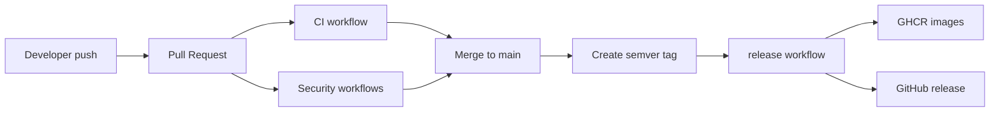

# Release Flow

## Commit to production path

## CI gates

- Python quality (history, physics, ai-assistant)
- Go tests (math)
- Java tests (geography)
- Frontend build
- Docker builds for all deployable units
- Compose validation
- Dependency scan (Trivy)
- Secrets scan (Gitleaks)
- SAST (CodeQL in dedicated workflow)

## Versioning

- Release trigger: push tag `vX.Y.Z`
- Artifacts:
  - GHCR images per service, tagged with release version
  - GitHub Release entry with generated notes
