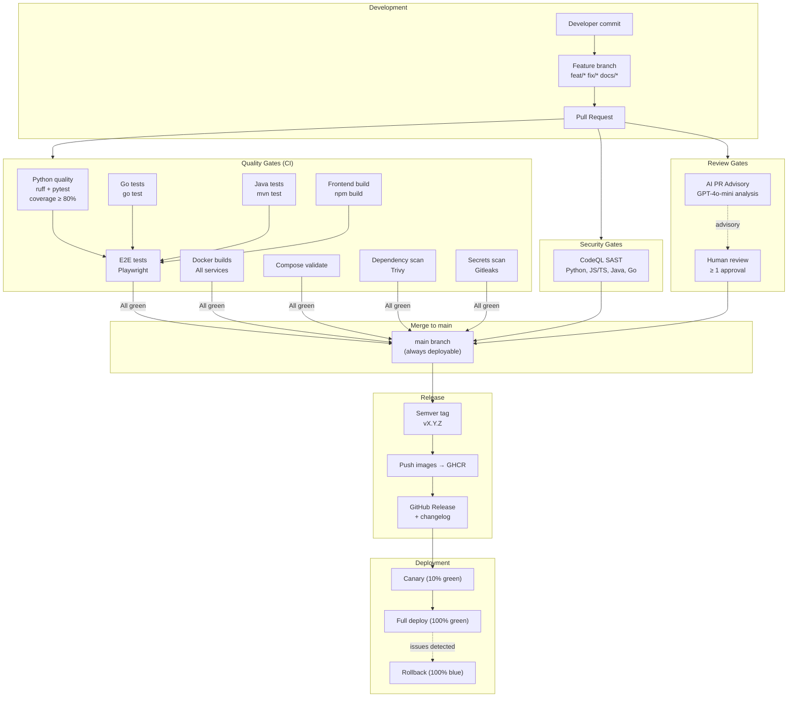
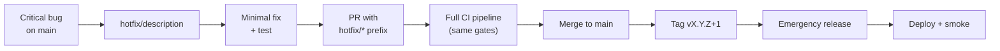

# Release Flow

## 1. Overview

This document describes the full path from developer commit to production-ready release, including quality gates at each stage, rollback procedures, and the hotfix process.

---

## 2. Commit-to-Release Pipeline


```mermaid
flowchart TD
    subgraph Dev["Development"]
        Commit["Developer commit"]
        Branch["Feature branch\nfeat/* fix/* docs/*"]
        PR["Pull Request"]
    end

    subgraph QualityGates["Quality Gates (CI)"]
        QP["Python quality\nruff + pytest\ncoverage ≥ 80%"]
        QG["Go tests\ngo test"]
        QJ["Java tests\nmvn test"]
        QF["Frontend build\nnpm build"]
        E2E["E2E tests\nPlaywright"]
        Docker["Docker builds\nAll services"]
        Compose["Compose validate"]
        Trivy["Dependency scan\nTrivy"]
        Gitleaks["Secrets scan\nGitleaks"]
    end

    subgraph Security["Security Gates"]
        CodeQL["CodeQL SAST\nPython, JS/TS, Java, Go"]
    end

    subgraph Review["Review Gates"]
        AI["AI PR Advisory\nGPT-4o-mini analysis"]
        Human["Human review\n≥ 1 approval"]
    end

    subgraph Merge["Merge to main"]
        Main["main branch\n(always deployable)"]
    end

    subgraph Release["Release"]
        Tag["Semver tag\nvX.Y.Z"]
        GHCR["Push images → GHCR"]
        GHRelease["GitHub Release\n+ changelog"]
    end

    subgraph Deploy["Deployment"]
        Canary["Canary (10% green)"]
        Full["Full deploy (100% green)"]
        Rollback["Rollback (100% blue)"]
    end

    Commit --> Branch --> PR
    PR --> QualityGates
    PR --> Security
    PR --> Review

    QP & QG & QJ & QF --> E2E
    E2E & Docker & Compose & Trivy & Gitleaks --> |"All green"| Main
    CodeQL --> Main
    Human --> Main
    AI -.->|"advisory"| Human

    Main --> Tag --> GHCR --> GHRelease
    GHRelease --> Canary --> Full
    Full -.->|"issues detected"| Rollback
```

---

## 3. Quality Gates Per Stage

### 3.1 PR Stage — Must Pass Before Merge

| # | Gate | Tool | Threshold | Blocks Merge? |
|---|------|------|-----------|:-------------:|
| G1 | Python linting | ruff | Zero warnings | Soft (logged) |
| G2 | Python tests + coverage | pytest + pytest-cov | Pass, ≥ 80% lines | **Yes** |
| G3 | Go tests | `go test` | Pass | **Yes** |
| G4 | Java tests | `mvn test` | Pass | **Yes** |
| G5 | Frontend build | `npm run build` | Compiles | **Yes** |
| G6 | E2E tests | Playwright | Pass | **Yes** |
| G7 | Docker build | `docker build` | All images build | **Yes** |
| G8 | Compose validation | `docker compose config` | Valid | **Yes** |
| G9 | Dependency scan | Trivy | No CRITICAL/HIGH | **Yes** |
| G10 | Secrets scan | Gitleaks | Clean | **Yes** |
| G11 | SAST | CodeQL | Clean | **Yes** |
| G12 | AI advisory | GPT-4o-mini | Review comments posted | No (informational) |
| G13 | Human review | GitHub reviewer | ≥ 1 approval | **Yes** |
| G14 | Branch up-to-date | GitHub | Rebased on latest `main` | **Yes** |

### 3.2 Release Stage — Tag Trigger

| Gate | Description |
|------|-------------|
| Tag format | Must match `vX.Y.Z` (semver) |
| All CI green on `main` | Tag is created only from a passing `main` commit |
| Docker build + push | All service images build and push to GHCR |
| GitHub Release creation | Automated release notes generated |

### 3.3 Post-Deploy Stage

| Gate | Command | Expected Result |
|------|---------|-----------------|
| Smoke test | `make smoke` | All services return 200 on `/readyz` |
| Contract check | `make contract` | All endpoints respond correctly |
| Canary observation | Monitor error rates at 10% traffic | No error spike |

---

## 4. Branch Model

```text
main ─────────────────────────────────────────── (always deployable)
  │
  ├── feat/add-quiz-timer ──── PR ──── merge ──┐
  ├── fix/answer-leak-edge ─── PR ──── merge ──┤
  ├── docs/update-readme ───── PR ──── merge ──┤
  └── hotfix/critical-503 ──── PR ──── merge ──┘
                                                │
                                          Tag v1.2.3
                                                │
                                        Release workflow
```

- **`main`** — protected branch. Always deployable. Requires passing CI + 1 review + up-to-date branch.
- **Feature branches** — `feat/*`, `fix/*`, `docs/*`, `chore/*`, `refactor/*`, `test/*`, `perf/*`, `ci/*` — short-lived branches off `main`.
- **No long-lived release branches** — releases are triggered by semver tags on `main`.

---

## 5. Release Process

### 5.1 Standard Release

```bash
git checkout main
git pull origin main

git tag v1.2.0
git push origin v1.2.0
```

`release.yml` automatically:
1. Logs into GitHub Container Registry (GHCR)
2. Builds Docker images for all services
3. Tags images: `ghcr.io/<owner>/qa-architect-<service>:v1.2.0`
4. Creates GitHub Release with auto-generated changelog

### 5.2 Versioning (Semver)

| Change Type | Version Bump | Commit Prefix |
|-------------|:------------:|---------------|
| Breaking change | **Major** (X.0.0) | `feat!:` or `BREAKING CHANGE:` |
| New feature | **Minor** (x.Y.0) | `feat:` |
| Bug fix | **Patch** (x.y.Z) | `fix:` |
| No version change | — | `docs:`, `chore:`, `refactor:`, `test:`, `ci:` |

---

## 6. Deployment Strategy

### 6.1 Blue/Green with Canary

The platform uses Traefik weighted routing for zero-downtime deployments:

```text
Step 1: Current state          Step 2: Canary               Step 3: Full deploy
┌────────────────────┐        ┌────────────────────┐       ┌────────────────────┐
│  100% → Blue (v1)  │   →    │  90% → Blue (v1)   │  →    │  100% → Green (v2) │
│                    │        │  10% → Green (v2)  │       │                    │
└────────────────────┘        └────────────────────┘       └────────────────────┘
```

| Command | Action | Traffic |
|---------|--------|---------|
| `make canary` | Deploy new version alongside old | 10% green, 90% blue |
| `make deploy-green` | Promote new version | 100% green |
| `make deploy-blue` | Rollback to old version | 100% blue |

### 6.2 Canary Observation Checklist

Before promoting from canary to full deploy:

- [ ] No increase in error rate (check gateway logs)
- [ ] Latency p95 within thresholds
- [ ] `make smoke` passes against new version
- [ ] No user-facing errors in frontend console

---

## 7. Rollback Procedure

### 7.1 Application Rollback (Routing)

**Time to rollback:** < 1 minute (routing change only).

```bash
make deploy-blue
```

This switches 100% traffic back to the blue (previous) version via Traefik weighted routing.

### 7.2 Full Rollback (Image Revert)

If the blue containers have been replaced:

```bash
docker compose --profile services down
git checkout v1.1.0       # previous known-good tag
docker compose --profile services up -d --build
bash infrastructure/scripts/wait-for-healthy.sh
make smoke
```

### 7.3 Database Rollback

For services with Alembic migrations (history, physics):

```bash
docker compose exec history alembic downgrade -1
docker compose exec physics alembic downgrade -1
```

> **Risk:** Downgrade scripts must be tested. Alembic `downgrade` reverses the last migration. For multi-step rollbacks, specify the target revision.

---

## 8. Hotfix Process


```mermaid
flowchart LR
    Bug["Critical bug\non main"] --> Branch["hotfix/description"]
    Branch --> Fix["Minimal fix\n+ test"]
    Fix --> PR["PR with\nhotfix/* prefix"]
    PR --> CI["Full CI pipeline\n(same gates)"]
    CI --> Merge["Merge to main"]
    Merge --> Tag["Tag vX.Y.Z+1"]
    Tag --> Release["Emergency release"]
    Release --> Deploy["Deploy + smoke"]
```

**Hotfix rules:**
1. Branch from `main`: `hotfix/<description>`
2. Minimal change — fix only the bug, no feature work
3. Add regression test for the bug
4. Same CI quality gates apply (no exceptions)
5. Immediate tag + release after merge
6. Run `make smoke` + `make contract` after deploy

---

## 9. Release Artifacts

| Artifact | Location | Format |
|----------|----------|--------|
| Docker images | `ghcr.io/<owner>/qa-architect-<service>:<tag>` | OCI image |
| GitHub Release | Repository → Releases | Markdown changelog |
| CI logs | GitHub Actions → Workflow runs | HTML |
| Security reports | GitHub Security tab | SARIF (CodeQL) |

---

## 10. Risks & Mitigations

| Risk | Mitigation |
|------|------------|
| Bad release reaches production | Canary at 10% first; instant rollback via `make deploy-blue` |
| Database migration breaks rollback | Test Alembic downgrade scripts; keep migrations backward-compatible |
| CI false positive blocks release | Manual override available via admin; investigate and fix root cause |
| GHCR unavailable | Docker images cached locally; release can be re-triggered when GHCR recovers |
| Hotfix skips quality gates | Not allowed — same CI pipeline for hotfix branches, no exceptions |
